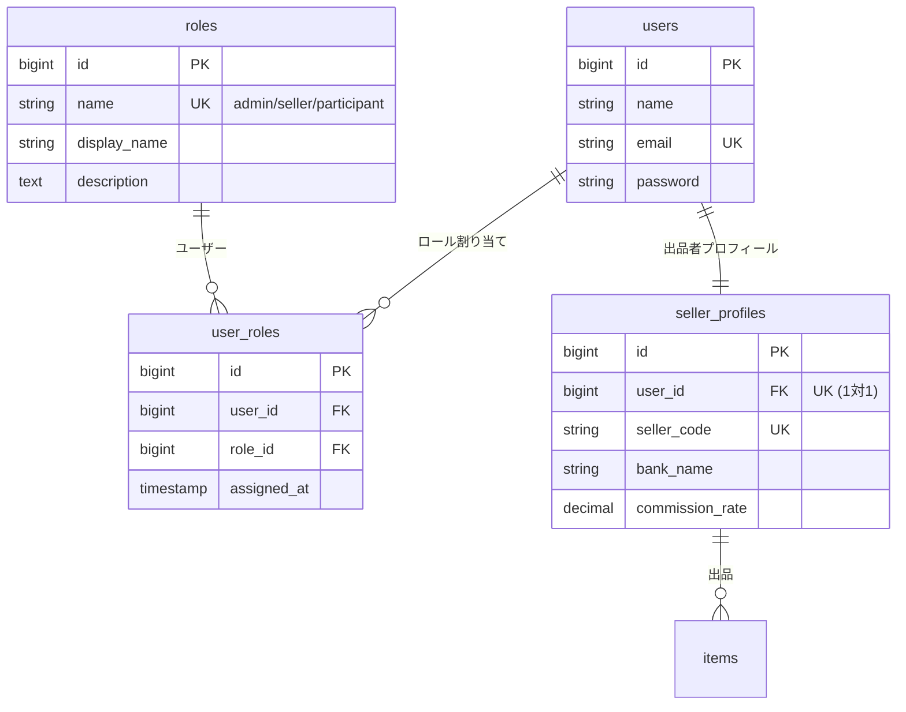

# メダカライブオークションシステム - データベース設計（v2.2 ロール対応版）

## 🔧 v2.2 の主な変更点

### 修正内容

**v2.1からの変更**:
1. ✅ **ロール管理の導入**
   - `roles` テーブル追加（admin, seller, participant）
   - `user_roles` テーブル追加（多対多関係）
   - `users.user_type` を削除

2. ✅ **出品者の正しい実装**
   - `sellers` → `seller_profiles` にリネーム
   - `seller_profiles.user_id` 追加（users と紐付け）
   - 出品者もログイン可能に

3. ✅ **柔軟なロール割り当て**
   - 1ユーザーが複数ロールを持てる
   - 例: seller かつ participant（出品しつつ入札も可能）

---

## 📐 設計思想

### ユーザーとロールの関係

```
users (ログインするユーザー)
  ├─ user_roles (ロール割り当て)
  │   ├─ admin (管理者)
  │   ├─ seller (出品者)
  │   └─ participant (参加者)
  └─ seller_profiles (出品者の追加情報)
```

### 実装例

#### ケース1: 管理者
```
User: 田中太郎
  └─ Roles: [admin]
```

#### ケース2: 出品者（入札もする）
```
User: 佐藤花子
  ├─ Roles: [seller, participant]
  └─ SellerProfile: (銀行口座、手数料率等)
```

#### ケース3: 参加者（入札のみ）
```
User: 鈴木一郎
  └─ Roles: [participant]
```

---

## テーブル定義（v2.2）

### 変更されたテーブル

#### 1. users（ユーザー）- 変更

**変更点**: `user_type` カラムを削除

| カラム名 | 型 | NULL | デフォルト | キー | 説明 | Phase |
|---------|---|------|----------|------|------|-------|
| id | BIGINT UNSIGNED | NO | AUTO | PK | ユーザーID | Phase1 |
| name | VARCHAR(255) | NO | - | | 氏名 | Phase1 |
| email | VARCHAR(255) | NO | - | UNQ | メールアドレス | Phase1 |
| email_verified_at | TIMESTAMP | YES | NULL | | メール認証日時 | Phase1 |
| password | VARCHAR(255) | NO | - | | パスワード（ハッシュ化） | Phase1 |
| ~~user_type~~ | ~~ENUM~~ | ~~NO~~ | ~~-~~ | ~~-~~ | ~~削除~~ | ~~-~~ |
| phone | VARCHAR(20) | YES | NULL | | 電話番号 | Phase1 |
| postal_code | VARCHAR(10) | YES | NULL | | 郵便番号 | Phase1 |
| prefecture | VARCHAR(50) | YES | NULL | | 都道府県 | Phase1 |
| city | VARCHAR(100) | YES | NULL | | 市区町村 | Phase1 |
| address_line1 | VARCHAR(255) | YES | NULL | | 住所1（番地） | Phase1 |
| address_line2 | VARCHAR(255) | YES | NULL | | 住所2（建物名等） | Phase1 |
| status | ENUM('pending','approved','suspended','rejected') | NO | 'pending' | IDX | 承認ステータス | Phase1 |
| approved_at | TIMESTAMP | YES | NULL | | 承認日時 | Phase1 |
| approved_by | BIGINT UNSIGNED | YES | NULL | FK | 承認者ID（管理者） | Phase1 |
| rejected_reason | TEXT | YES | NULL | | 却下理由 | Phase1 |
| last_login_at | TIMESTAMP | YES | NULL | | 最終ログイン日時 | Phase1 |
| is_active | BOOLEAN | NO | TRUE | | アカウント有効フラグ | Phase1 |
| remember_token | VARCHAR(100) | YES | NULL | | ログイン維持トークン | Phase1 |
| created_at | TIMESTAMP | NO | CURRENT_TIMESTAMP | | 作成日時 | Phase1 |
| updated_at | TIMESTAMP | NO | CURRENT_TIMESTAMP | | 更新日時 | Phase1 |
| deleted_at | TIMESTAMP | YES | NULL | | 論理削除日時 | Phase1 |

---

#### 2. roles（ロール）- 新規追加

**目的**: システムで使用可能なロールを定義

| カラム名 | 型 | NULL | デフォルト | キー | 説明 | Phase |
|---------|---|------|----------|------|------|-------|
| id | BIGINT UNSIGNED | NO | AUTO | PK | ロールID | Phase1 |
| name | VARCHAR(50) | NO | - | UNQ | ロール名 | Phase1 |
| display_name | VARCHAR(100) | NO | - | | 表示名 | Phase1 |
| description | TEXT | YES | NULL | | 説明 | Phase1 |
| created_at | TIMESTAMP | NO | CURRENT_TIMESTAMP | | 作成日時 | Phase1 |
| updated_at | TIMESTAMP | NO | CURRENT_TIMESTAMP | | 更新日時 | Phase1 |

**初期データ**:
```sql
INSERT INTO roles (name, display_name, description) VALUES
('admin', '管理者', 'システム全体の管理権限'),
('seller', '出品者', '生体を出品する権限'),
('participant', '参加者', 'オークションに参加して入札する権限');
```

**インデックス**:
```sql
PRIMARY KEY (id)
UNIQUE KEY uk_name (name)
```

---

#### 3. user_roles（ユーザーロール）- 新規追加

**目的**: ユーザーとロールの多対多関係を管理

| カラム名 | 型 | NULL | デフォルト | キー | 説明 | Phase |
|---------|---|------|----------|------|------|-------|
| id | BIGINT UNSIGNED | NO | AUTO | PK | ID | Phase1 |
| user_id | BIGINT UNSIGNED | NO | - | FK,IDX | ユーザーID | Phase1 |
| role_id | BIGINT UNSIGNED | NO | - | FK,IDX | ロールID | Phase1 |
| assigned_at | TIMESTAMP | NO | CURRENT_TIMESTAMP | | 付与日時 | Phase1 |
| assigned_by | BIGINT UNSIGNED | YES | NULL | FK | 付与者ID（管理者） | Phase1 |
| created_at | TIMESTAMP | NO | CURRENT_TIMESTAMP | | 作成日時 | Phase1 |
| updated_at | TIMESTAMP | NO | CURRENT_TIMESTAMP | | 更新日時 | Phase1 |

**インデックス・制約**:
```sql
PRIMARY KEY (id)
UNIQUE KEY uk_user_role (user_id, role_id)
INDEX idx_user (user_id)
INDEX idx_role (role_id)
FOREIGN KEY fk_user_id (user_id) REFERENCES users(id) ON DELETE CASCADE
FOREIGN KEY fk_role_id (role_id) REFERENCES roles(id) ON DELETE CASCADE
FOREIGN KEY fk_assigned_by (assigned_by) REFERENCES users(id) ON DELETE SET NULL
```

---

#### 4. seller_profiles（出品者プロフィール）- リネーム

**旧名**: `sellers`  
**新名**: `seller_profiles`  
**変更点**: `user_id` カラムを追加し、users テーブルと紐付け

| カラム名 | 型 | NULL | デフォルト | キー | 説明 | Phase |
|---------|---|------|----------|------|------|-------|
| id | BIGINT UNSIGNED | NO | AUTO | PK | プロフィールID | Phase2 |
| **user_id** | **BIGINT UNSIGNED** | **NO** | **-** | **FK,UNQ** | **ユーザーID** | **Phase1** |
| seller_code | VARCHAR(50) | NO | - | UNQ | 出品者コード（識別用） | Phase2 |
| seller_name | VARCHAR(255) | NO | - | | 出品者名（屋号・氏名） | Phase2 |
| contact_name | VARCHAR(255) | YES | NULL | | 担当者名 | Phase2 |
| email | VARCHAR(255) | NO | - | IDX | メールアドレス | Phase2 |
| phone | VARCHAR(20) | NO | - | | 電話番号 | Phase2 |
| postal_code | VARCHAR(10) | YES | NULL | | 郵便番号 | Phase2 |
| prefecture | VARCHAR(50) | YES | NULL | | 都道府県 | Phase2 |
| city | VARCHAR(100) | YES | NULL | | 市区町村 | Phase2 |
| address_line1 | VARCHAR(255) | YES | NULL | | 住所1 | Phase2 |
| address_line2 | VARCHAR(255) | YES | NULL | | 住所2 | Phase2 |
| bank_name | VARCHAR(100) | YES | NULL | | 銀行名 | Phase2 |
| bank_branch | VARCHAR(100) | YES | NULL | | 支店名 | Phase2 |
| account_type | ENUM('checking','savings') | YES | NULL | | 口座種別 | Phase2 |
| account_number | VARCHAR(20) | YES | NULL | | 口座番号 | Phase2 |
| account_holder | VARCHAR(100) | YES | NULL | | 口座名義 | Phase2 |
| commission_rate | DECIMAL(5,2) | NO | 10.00 | | 手数料率（%） | Phase2 |
| notes | TEXT | YES | NULL | | 備考 | Phase2 |
| is_enabled | BOOLEAN | NO | FALSE | IDX | 機能有効フラグ | Phase2 |
| is_active | BOOLEAN | NO | TRUE | IDX | 有効フラグ | Phase2 |
| created_at | TIMESTAMP | NO | CURRENT_TIMESTAMP | | 作成日時 | Phase2 |
| updated_at | TIMESTAMP | NO | CURRENT_TIMESTAMP | | 更新日時 | Phase2 |

**インデックス・制約**:
```sql
PRIMARY KEY (id)
UNIQUE KEY uk_user_id (user_id)
UNIQUE KEY uk_seller_code (seller_code)
INDEX idx_email (email)
INDEX idx_enabled (is_enabled)
INDEX idx_active (is_active)
FOREIGN KEY fk_user_id (user_id) REFERENCES users(id) ON DELETE CASCADE
```

---

#### 5. items（生体/商品）- 変更

**変更点**: `seller_id` → `seller_profile_id` にリネーム

| カラム名 | 変更 | 説明 |
|---------|------|------|
| ~~seller_id~~ | 削除 | 旧カラム名 |
| **seller_profile_id** | **追加** | **新カラム名（seller_profiles.id を参照）** |

---

## 📊 新しいリレーション



---

## 💻 実装例

### 1. ロールの確認

```php
// ユーザーが特定のロールを持っているか確認
if ($user->hasRole('admin')) {
    // 管理者のみの処理
}

if ($user->hasRole('seller')) {
    // 出品者のみの処理
}

if ($user->hasRole('participant')) {
    // 参加者のみの処理
}

// 複数ロールの確認
if ($user->hasAnyRole(['seller', 'admin'])) {
    // 出品者または管理者の処理
}

if ($user->hasAllRoles(['seller', 'participant'])) {
    // 出品者かつ参加者の処理
}
```

### 2. ロールの付与

```php
use App\Models\Role;

// ユーザー登録時（デフォルトで participant を付与）
$user = User::create([...]);
$participantRole = Role::where('name', 'participant')->first();
$user->roles()->attach($participantRole->id, [
    'assigned_at' => now(),
    'assigned_by' => auth()->id(),
]);

// 出品者申請承認時
$sellerRole = Role::where('name', 'seller')->first();
$user->roles()->attach($sellerRole->id, [
    'assigned_at' => now(),
    'assigned_by' => auth()->id(), // 管理者
]);

// SellerProfile を作成
SellerProfile::create([
    'user_id' => $user->id,
    'seller_code' => 'S' . str_pad($user->id, 6, '0', STR_PAD_LEFT),
    'seller_name' => $user->name,
    'email' => $user->email,
    'phone' => $user->phone,
    // ...
]);
```

### 3. 出品者情報の取得

```php
// ユーザーから出品者プロフィールを取得
$user = User::find(1);
if ($sellerProfile = $user->sellerProfile) {
    echo $sellerProfile->bank_name;
    echo $sellerProfile->account_number;
}

// 出品者として商品を登録
if ($user->hasRole('seller') && $user->sellerProfile) {
    Item::create([
        'auction_id' => $auctionId,
        'seller_profile_id' => $user->sellerProfile->id,
        'species_name' => '紅白メダカ',
        // ...
    ]);
}
```

### 4. Eloquent リレーション定義

```php
// User.php
class User extends Authenticatable
{
    public function roles()
    {
        return $this->belongsToMany(Role::class, 'user_roles')
            ->withPivot('assigned_at', 'assigned_by')
            ->withTimestamps();
    }
    
    public function sellerProfile()
    {
        return $this->hasOne(SellerProfile::class);
    }
    
    public function hasRole($roleName)
    {
        return $this->roles()->where('name', $roleName)->exists();
    }
    
    public function hasAnyRole(array $roleNames)
    {
        return $this->roles()->whereIn('name', $roleNames)->exists();
    }
    
    public function hasAllRoles(array $roleNames)
    {
        return $this->roles()->whereIn('name', $roleNames)->count() === count($roleNames);
    }
}

// Role.php
class Role extends Model
{
    public function users()
    {
        return $this->belongsToMany(User::class, 'user_roles')
            ->withPivot('assigned_at', 'assigned_by')
            ->withTimestamps();
    }
}

// SellerProfile.php
class SellerProfile extends Model
{
    public function user()
    {
        return $this->belongsTo(User::class);
    }
    
    public function items()
    {
        return $this->hasMany(Item::class);
    }
}

// Item.php
class Item extends Model
{
    public function sellerProfile()
    {
        return $this->belongsTo(SellerProfile::class);
    }
    
    // ヘルパー: 出品者ユーザーを取得
    public function seller()
    {
        return $this->sellerProfile ? $this->sellerProfile->user : null;
    }
}
```

---

## 🔒 権限チェック例

### Middleware

```php
// app/Http/Middleware/CheckRole.php
class CheckRole
{
    public function handle($request, Closure $next, ...$roles)
    {
        if (!auth()->check()) {
            abort(401);
        }
        
        if (!auth()->user()->hasAnyRole($roles)) {
            abort(403, 'この操作には権限がありません');
        }
        
        return $next($request);
    }
}

// routes/api.php
Route::middleware(['auth', 'check.role:admin'])->group(function () {
    // 管理者のみアクセス可能
    Route::get('/admin/dashboard', [AdminController::class, 'dashboard']);
});

Route::middleware(['auth', 'check.role:seller,admin'])->group(function () {
    // 出品者または管理者のみアクセス可能
    Route::post('/items', [ItemController::class, 'store']);
});

Route::middleware(['auth', 'check.role:participant'])->group(function () {
    // 参加者のみアクセス可能（実際は seller も participant を持つことがある）
    Route::post('/bids/{itemId}/join', [BidController::class, 'join']);
});
```

---

## 📋 マイグレーション実行順序

### v2.2 への移行手順

```bash
# 1. 既存のマイグレーションを実行（まだの場合）
php artisan migrate

# 2. v2.2 の新しいマイグレーションを実行
php artisan migrate

# 実行されるマイグレーション：
# ✅ 2024_01_16_200001_create_roles_table.php
# ✅ 2024_01_16_200002_create_user_roles_table.php
# ✅ 2024_01_16_200003_rename_sellers_to_seller_profiles.php
# ✅ 2024_01_16_200004_remove_user_type_from_users.php
```

---

## 🎯 v2.2 の利点

### ✅ 1. 正しい認証設計
- すべてのユーザー（管理者、出品者、参加者）がログイン可能
- パスワード管理が統一

### ✅ 2. 柔軟なロール管理
- 1ユーザーが複数ロールを持てる
- 出品者が自分の商品に入札できる
- ロールの追加・削除が容易

### ✅ 3. 拡張性
- 新しいロール（例: moderator）を追加しやすい
- 権限管理を細かく制御可能

### ✅ 4. データの正規化
- ユーザー情報（users）と出品者追加情報（seller_profiles）が分離
- データの重複がない

---

**v2.2 でロール管理が正しく実装されました！** 🎉
