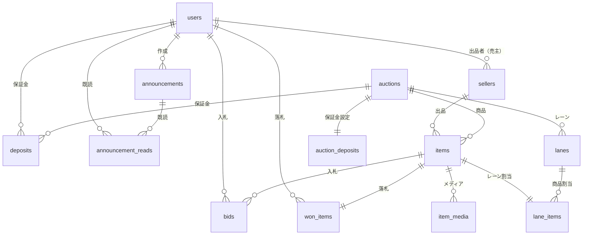

# メダカライブオークションシステム - データベース設計（完全版）

## 📋 目次

1. [ER図概要](#er図概要)
2. [テーブル定義（全14テーブル）](#テーブル定義)
3. [リレーション図](#リレーション図)
4. [インデックス戦略](#インデックス戦略)
5. [トランザクション設計](#トランザクション設計)
6. [データ整合性制約](#データ整合性制約)
7. [パフォーマンス最適化](#パフォーマンス最適化)

---

## ER図概要

```
users (ユーザー)
  ├── bids (入札) [参加者として]
  ├── won_items (落札) [落札者として]
  ├── deposits (保証金) [参加者として]
  ├── sellers (出品者情報) [出品者として]
  └── announcements (お知らせ作成) [管理者として]

sellers (出品者)
  └── items (出品商品)

auctions (オークションイベント)
  ├── items (生体/商品)
  ├── lanes (レーン)
  └── auction_deposits (オークション別保証金設定)

items (生体/商品)
  ├── item_media (メディアファイル)
  ├── bids (入札)
  ├── won_items (落札)
  └── lane_items (レーン割り当て)

lanes (レーン)
  └── lane_items (レーン商品)

announcements (お知らせ)
  └── announcement_reads (既読管理)

system_settings (システム設定)
```

---

## テーブル定義

### 1. users（ユーザー）

**概要**: システム利用者全体（管理者・参加者）を管理

| カラム名 | 型 | NULL | デフォルト | キー | 説明 |
|---------|---|------|----------|------|------|
| id | BIGINT UNSIGNED | NO | AUTO | PK | ユーザーID |
| name | VARCHAR(255) | NO | - | | 氏名 |
| email | VARCHAR(255) | NO | - | UNQ | メールアドレス |
| email_verified_at | TIMESTAMP | YES | NULL | | メール認証日時 |
| password | VARCHAR(255) | NO | - | | パスワード（ハッシュ化） |
| user_type | ENUM('admin','participant') | NO | 'participant' | IDX | ユーザー種別 |
| phone | VARCHAR(20) | YES | NULL | | 電話番号 |
| postal_code | VARCHAR(10) | YES | NULL | | 郵便番号 |
| prefecture | VARCHAR(50) | YES | NULL | | 都道府県 |
| city | VARCHAR(100) | YES | NULL | | 市区町村 |
| address_line1 | VARCHAR(255) | YES | NULL | | 住所1（番地） |
| address_line2 | VARCHAR(255) | YES | NULL | | 住所2（建物名等） |
| status | ENUM('pending','approved','suspended','rejected') | NO | 'pending' | IDX | 承認ステータス |
| approved_at | TIMESTAMP | YES | NULL | | 承認日時 |
| approved_by | BIGINT UNSIGNED | YES | NULL | FK | 承認者ID（管理者） |
| rejected_reason | TEXT | YES | NULL | | 却下理由 |
| last_login_at | TIMESTAMP | YES | NULL | | 最終ログイン日時 |
| is_active | BOOLEAN | NO | TRUE | | アカウント有効フラグ |
| remember_token | VARCHAR(100) | YES | NULL | | ログイン維持トークン |
| created_at | TIMESTAMP | NO | CURRENT_TIMESTAMP | | 作成日時 |
| updated_at | TIMESTAMP | NO | CURRENT_TIMESTAMP | | 更新日時 |
| deleted_at | TIMESTAMP | YES | NULL | | 論理削除日時 |

**ユーザー種別**
- `admin`: 管理者（オークション運営）
- `participant`: 参加者（入札者）

**承認ステータス**
- `pending`: 承認待ち（初期状態）
- `approved`: 承認済み（入札可能）
- `suspended`: 停止中（一時的に入札不可）
- `rejected`: 却下（登録拒否）

**インデックス**
```sql
PRIMARY KEY (id)
UNIQUE KEY uk_email (email)
INDEX idx_user_type (user_type)
INDEX idx_status (status)
INDEX idx_approved (status, approved_at)
FOREIGN KEY fk_approved_by (approved_by) REFERENCES users(id) ON DELETE SET NULL
```

**制約**
- メールアドレスは一意
- 承認者は必ず管理者（application層で制御）
- 論理削除対応（deleted_at）

---

### 2. sellers（出品者）

**概要**: 生体を出品する業者・個人の情報管理

| カラム名 | 型 | NULL | デフォルト | キー | 説明 |
|---------|---|------|----------|------|------|
| id | BIGINT UNSIGNED | NO | AUTO | PK | 出品者ID |
| seller_code | VARCHAR(50) | NO | - | UNQ | 出品者コード（識別用） |
| seller_name | VARCHAR(255) | NO | - | | 出品者名（屋号・氏名） |
| contact_name | VARCHAR(255) | YES | NULL | | 担当者名 |
| email | VARCHAR(255) | NO | - | IDX | メールアドレス |
| phone | VARCHAR(20) | NO | - | | 電話番号 |
| postal_code | VARCHAR(10) | YES | NULL | | 郵便番号 |
| prefecture | VARCHAR(50) | YES | NULL | | 都道府県 |
| city | VARCHAR(100) | YES | NULL | | 市区町村 |
| address_line1 | VARCHAR(255) | YES | NULL | | 住所1 |
| address_line2 | VARCHAR(255) | YES | NULL | | 住所2 |
| bank_name | VARCHAR(100) | YES | NULL | | 銀行名 |
| bank_branch | VARCHAR(100) | YES | NULL | | 支店名 |
| account_type | ENUM('checking','savings') | YES | NULL | | 口座種別 |
| account_number | VARCHAR(20) | YES | NULL | | 口座番号 |
| account_holder | VARCHAR(100) | YES | NULL | | 口座名義 |
| commission_rate | DECIMAL(5,2) | NO | 10.00 | | 手数料率（%） |
| notes | TEXT | YES | NULL | | 備考 |
| is_active | BOOLEAN | NO | TRUE | IDX | 有効フラグ |
| created_at | TIMESTAMP | NO | CURRENT_TIMESTAMP | | 作成日時 |
| updated_at | TIMESTAMP | NO | CURRENT_TIMESTAMP | | 更新日時 |

**口座種別**
- `checking`: 普通預金
- `savings`: 当座預金

**インデックス**
```sql
PRIMARY KEY (id)
UNIQUE KEY uk_seller_code (seller_code)
INDEX idx_email (email)
INDEX idx_active (is_active)
```

---

### 3. auctions（オークションイベント）

**概要**: オークション開催単位の管理

| カラム名 | 型 | NULL | デフォルト | キー | 説明 |
|---------|---|------|----------|------|------|
| id | BIGINT UNSIGNED | NO | AUTO | PK | オークションID |
| title | VARCHAR(255) | NO | - | | オークション名 |
| event_date | DATE | NO | - | IDX | 開催日 |
| start_time | TIME | NO | '10:00:00' | | 開始時刻 |
| end_time | TIME | YES | NULL | | 終了時刻（実績） |
| status | ENUM('preparing','scheduled','live','finished','cancelled') | NO | 'preparing' | IDX | ステータス |
| description | TEXT | YES | NULL | | 説明 |
| lane_count | TINYINT UNSIGNED | NO | 6 | | レーン数 |
| default_bid_increment | DECIMAL(10,2) | NO | 100.00 | | デフォルト入札単位 |
| countdown_seconds | INT UNSIGNED | NO | 3 | | カウントダウン秒数 |
| deposit_required | BOOLEAN | NO | FALSE | | 保証金必須フラグ |
| upload_deadline | TIMESTAMP | YES | NULL | | 商品アップロード期限 |
| payment_deadline_hours | INT UNSIGNED | NO | 24 | | 入金期限（時間） |
| shipping_deadline_hours | INT UNSIGNED | NO | 48 | | 発送期限（時間） |
| created_by | BIGINT UNSIGNED | NO | - | FK | 作成者ID（管理者） |
| created_at | TIMESTAMP | NO | CURRENT_TIMESTAMP | | 作成日時 |
| updated_at | TIMESTAMP | NO | CURRENT_TIMESTAMP | | 更新日時 |

**ステータス**
- `preparing`: 準備中（編集可能）
- `scheduled`: 予定（商品登録完了）
- `live`: 開催中（入札可能）
- `finished`: 終了（編集・削除不可）
- `cancelled`: キャンセル

**インデックス**
```sql
PRIMARY KEY (id)
INDEX idx_event_date (event_date)
INDEX idx_status (status)
INDEX idx_event_status (event_date, status)
FOREIGN KEY fk_created_by (created_by) REFERENCES users(id) ON DELETE RESTRICT
```

**制約**
- `status = 'finished'` の場合、編集・削除不可（application層で制御）
- `lane_count` は1〜10の範囲（CHECK制約）

---

### 4. auction_deposits（オークション別保証金設定）

**概要**: オークションごとの保証金設定

| カラム名 | 型 | NULL | デフォルト | キー | 説明 |
|---------|---|------|----------|------|------|
| id | BIGINT UNSIGNED | NO | AUTO | PK | ID |
| auction_id | BIGINT UNSIGNED | NO | - | FK,UNQ | オークションID |
| deposit_amount | DECIMAL(10,2) | NO | 0.00 | | 保証金額 |
| deposit_type | ENUM('none','fixed','flexible') | NO | 'none' | | 保証金タイプ |
| description | TEXT | YES | NULL | | 説明 |
| created_at | TIMESTAMP | NO | CURRENT_TIMESTAMP | | 作成日時 |
| updated_at | TIMESTAMP | NO | CURRENT_TIMESTAMP | | 更新日時 |

**保証金タイプ**
- `none`: 保証金なし
- `fixed`: 一律固定（主催者側で設定）
- `flexible`: 参加者が自由に設定

**インデックス**
```sql
PRIMARY KEY (id)
UNIQUE KEY uk_auction (auction_id)
FOREIGN KEY fk_auction_id (auction_id) REFERENCES auctions(id) ON DELETE CASCADE
```

---

### 5. deposits（保証金管理）

**概要**: 参加者の保証金預かり状況

| カラム名 | 型 | NULL | デフォルト | キー | 説明 |
|---------|---|------|----------|------|------|
| id | BIGINT UNSIGNED | NO | AUTO | PK | 保証金ID |
| auction_id | BIGINT UNSIGNED | NO | - | FK,IDX | オークションID |
| user_id | BIGINT UNSIGNED | NO | - | FK,IDX | ユーザーID |
| deposit_amount | DECIMAL(10,2) | NO | 0.00 | | 預かり金額 |
| payment_method | ENUM('bank_transfer','credit_card','cash') | NO | 'bank_transfer' | | 支払い方法 |
| payment_status | ENUM('pending','confirmed','refunded','forfeited') | NO | 'pending' | IDX | 支払いステータス |
| paid_at | TIMESTAMP | YES | NULL | | 入金日時 |
| refunded_at | TIMESTAMP | YES | NULL | | 返金日時 |
| refund_amount | DECIMAL(10,2) | YES | NULL | | 返金額 |
| notes | TEXT | YES | NULL | | 備考 |
| created_at | TIMESTAMP | NO | CURRENT_TIMESTAMP | | 作成日時 |
| updated_at | TIMESTAMP | NO | CURRENT_TIMESTAMP | | 更新日時 |

**支払い方法**
- `bank_transfer`: 銀行振込
- `credit_card`: クレジットカード
- `cash`: 現金

**支払いステータス**
- `pending`: 入金待ち
- `confirmed`: 入金確認済み
- `refunded`: 返金済み
- `forfeited`: 没収（ペナルティ）

**インデックス**
```sql
PRIMARY KEY (id)
UNIQUE KEY uk_auction_user (auction_id, user_id)
INDEX idx_user (user_id)
INDEX idx_payment_status (payment_status)
FOREIGN KEY fk_auction_id (auction_id) REFERENCES auctions(id) ON DELETE CASCADE
FOREIGN KEY fk_user_id (user_id) REFERENCES users(id) ON DELETE CASCADE
```

---

### 6. items（生体/商品）

**概要**: オークション出品商品（メダカ個体）

| カラム名 | 型 | NULL | デフォルト | キー | 説明 |
|---------|---|------|----------|------|------|
| id | BIGINT UNSIGNED | NO | AUTO | PK | 生体ID |
| auction_id | BIGINT UNSIGNED | NO | - | FK,IDX | オークションID |
| seller_id | BIGINT UNSIGNED | NO | - | FK,IDX | 出品者ID |
| item_number | INT UNSIGNED | NO | - | IDX | 生体番号（オークション内） |
| species_name | VARCHAR(255) | NO | - | | 品種名 |
| quantity | INT UNSIGNED | NO | 1 | | 匹数 |
| start_price | DECIMAL(10,2) | NO | 100.00 | | 開始価格（1匹あたり） |
| current_price | DECIMAL(10,2) | NO | 100.00 | | 現在価格（1匹あたり） |
| reserve_price | DECIMAL(10,2) | YES | NULL | | 最低落札価格 |
| estimated_price | DECIMAL(10,2) | YES | NULL | | 落札想定金額 |
| bid_increment | DECIMAL(10,2) | NO | 100.00 | | 入札単位 |
| inspection_info | TEXT | YES | NULL | | 審査情報 |
| individual_info | TEXT | YES | NULL | | 個体情報（出品者記載） |
| notes | TEXT | YES | NULL | | 備考 |
| is_premium | BOOLEAN | NO | FALSE | IDX | プレミアムプランフラグ |
| premium_fee | DECIMAL(10,2) | YES | NULL | | プレミアムプラン料金 |
| thumbnail_path | VARCHAR(500) | YES | NULL | | サムネイル画像パス |
| status | ENUM('draft','registered','live','sold','unsold','cancelled') | NO | 'draft' | IDX | ステータス |
| unsold_action | ENUM('return','free_pickup','relist') | YES | 'return' | | 未落札時対応 |
| storage_fee | DECIMAL(10,2) | YES | NULL | | 保管料（次回出品時） |
| live_started_at | TIMESTAMP | YES | NULL | | オークション開始日時 |
| live_ended_at | TIMESTAMP | YES | NULL | | オークション終了日時 |
| created_at | TIMESTAMP | NO | CURRENT_TIMESTAMP | | 作成日時 |
| updated_at | TIMESTAMP | NO | CURRENT_TIMESTAMP | | 更新日時 |

**ステータス**
- `draft`: 下書き
- `registered`: 登録済み（オークション前）
- `live`: オークション中
- `sold`: 落札済み
- `unsold`: 未落札
- `cancelled`: キャンセル

**未落札時対応**
- `return`: 返送（デフォルト）
- `free_pickup`: 無料引取希望
- `relist`: 次回オークション出品（保管料請求）

**インデックス**
```sql
PRIMARY KEY (id)
UNIQUE KEY uk_auction_item_number (auction_id, item_number)
INDEX idx_auction (auction_id)
INDEX idx_seller (seller_id)
INDEX idx_status (status)
INDEX idx_premium (is_premium)
INDEX idx_auction_status (auction_id, status, item_number)
FOREIGN KEY fk_auction_id (auction_id) REFERENCES auctions(id) ON DELETE CASCADE
FOREIGN KEY fk_seller_id (seller_id) REFERENCES sellers(id) ON DELETE RESTRICT
```

**制約**
- `quantity` は1以上（CHECK制約）
- `current_price >= start_price`（application層で制御）

---

### 7. item_media（生体メディア）

**概要**: 商品の画像・動画ファイル管理

| カラム名 | 型 | NULL | デフォルト | キー | 説明 |
|---------|---|------|----------|------|------|
| id | BIGINT UNSIGNED | NO | AUTO | PK | メディアID |
| item_id | BIGINT UNSIGNED | NO | - | FK,IDX | 生体ID |
| media_type | ENUM('video_top','video_side','photo_top','photo_side','photo_other') | NO | - | IDX | メディア種別 |
| file_path | VARCHAR(500) | NO | - | | ファイルパス |
| file_name | VARCHAR(255) | NO | - | | ファイル名 |
| file_size | BIGINT UNSIGNED | YES | NULL | | ファイルサイズ（バイト） |
| mime_type | VARCHAR(100) | YES | NULL | | MIMEタイプ |
| duration | INT UNSIGNED | YES | NULL | | 再生時間（秒、動画のみ） |
| width | INT UNSIGNED | YES | NULL | | 幅（ピクセル） |
| height | INT UNSIGNED | YES | NULL | | 高さ（ピクセル） |
| display_order | INT UNSIGNED | NO | 0 | | 表示順序 |
| is_thumbnail | BOOLEAN | NO | FALSE | | サムネイルフラグ |
| uploaded_at | TIMESTAMP | NO | CURRENT_TIMESTAMP | | アップロード日時 |
| created_at | TIMESTAMP | NO | CURRENT_TIMESTAMP | | 作成日時 |
| updated_at | TIMESTAMP | NO | CURRENT_TIMESTAMP | | 更新日時 |

**メディア種別**
- `video_top`: 上見動画（30秒）
- `video_side`: 横見動画（30秒）
- `photo_top`: 上見写真（プレミアム）
- `photo_side`: 横見写真（プレミアム）
- `photo_other`: その他写真（プレミアム）

**インデックス**
```sql
PRIMARY KEY (id)
INDEX idx_item (item_id)
INDEX idx_item_type (item_id, media_type)
INDEX idx_item_order (item_id, display_order)
FOREIGN KEY fk_item_id (item_id) REFERENCES items(id) ON DELETE CASCADE
```

---

### 8. lanes（レーン）

**概要**: オークション進行のレーン管理

| カラム名 | 型 | NULL | デフォルト | キー | 説明 |
|---------|---|------|----------|------|------|
| id | BIGINT UNSIGNED | NO | AUTO | PK | レーンID |
| auction_id | BIGINT UNSIGNED | NO | - | FK,IDX | オークションID |
| lane_number | TINYINT UNSIGNED | NO | - | IDX | レーン番号（1-6） |
| lane_name | VARCHAR(100) | YES | NULL | | レーン名 |
| current_item_id | BIGINT UNSIGNED | YES | NULL | FK | 現在の生体ID |
| status | ENUM('waiting','active','paused','finished') | NO | 'waiting' | IDX | ステータス |
| started_at | TIMESTAMP | YES | NULL | | 開始日時 |
| finished_at | TIMESTAMP | YES | NULL | | 終了日時 |
| created_at | TIMESTAMP | NO | CURRENT_TIMESTAMP | | 作成日時 |
| updated_at | TIMESTAMP | NO | CURRENT_TIMESTAMP | | 更新日時 |

**ステータス**
- `waiting`: 待機中
- `active`: 進行中
- `paused`: 一時停止
- `finished`: 終了

**インデックス**
```sql
PRIMARY KEY (id)
UNIQUE KEY uk_auction_lane (auction_id, lane_number)
INDEX idx_auction (auction_id)
INDEX idx_status (status)
FOREIGN KEY fk_auction_id (auction_id) REFERENCES auctions(id) ON DELETE CASCADE
FOREIGN KEY fk_current_item_id (current_item_id) REFERENCES items(id) ON DELETE SET NULL
```

---

### 9. lane_items（レーン商品割り当て）

**概要**: 各レーンへの商品割り当てと進行順序

| カラム名 | 型 | NULL | デフォルト | キー | 説明 |
|---------|---|------|----------|------|------|
| id | BIGINT UNSIGNED | NO | AUTO | PK | ID |
| lane_id | BIGINT UNSIGNED | NO | - | FK,IDX | レーンID |
| item_id | BIGINT UNSIGNED | NO | - | FK,UNQ | 生体ID |
| sequence_order | INT UNSIGNED | NO | - | IDX | レーン内順序 |
| started_at | TIMESTAMP | YES | NULL | | 開始日時 |
| finished_at | TIMESTAMP | YES | NULL | | 終了日時 |
| duration_seconds | INT UNSIGNED | YES | NULL | | 所要時間（秒） |
| created_at | TIMESTAMP | NO | CURRENT_TIMESTAMP | | 作成日時 |
| updated_at | TIMESTAMP | NO | CURRENT_TIMESTAMP | | 更新日時 |

**インデックス**
```sql
PRIMARY KEY (id)
UNIQUE KEY uk_item (item_id)
INDEX idx_lane_order (lane_id, sequence_order)
INDEX idx_lane (lane_id)
FOREIGN KEY fk_lane_id (lane_id) REFERENCES lanes(id) ON DELETE CASCADE
FOREIGN KEY fk_item_id (item_id) REFERENCES items(id) ON DELETE CASCADE
```

**制約**
- 1商品は1レーンにのみ割り当て可能（uk_item）
- 同一出品者の商品は同じレーンに固める（application層で制御）

---

### 10. bids（入札）

**概要**: リアルタイム入札記録

| カラム名 | 型 | NULL | デフォルト | キー | 説明 |
|---------|---|------|----------|------|------|
| id | BIGINT UNSIGNED | NO | AUTO | PK | 入札ID |
| item_id | BIGINT UNSIGNED | NO | - | FK,IDX | 生体ID |
| bidder_id | BIGINT UNSIGNED | NO | - | FK,IDX | 入札者ID |
| bid_price | DECIMAL(10,2) | NO | - | | 入札価格（1匹あたり） |
| total_amount | DECIMAL(10,2) | NO | - | | 合計金額（価格×匹数） |
| is_active | BOOLEAN | NO | TRUE | IDX | アクティブフラグ（ON/OFF） |
| bid_type | ENUM('manual','auto') | NO | 'manual' | | 入札タイプ |
| ip_address | VARCHAR(45) | YES | NULL | | IPアドレス |
| user_agent | TEXT | YES | NULL | | ユーザーエージェント |
| created_at | TIMESTAMP | NO | CURRENT_TIMESTAMP | IDX | 作成日時 |
| updated_at | TIMESTAMP | NO | CURRENT_TIMESTAMP | | 更新日時 |

**入札タイプ**
- `manual`: 手動入札
- `auto`: 自動上昇（複数人入札時）

**インデックス**
```sql
PRIMARY KEY (id)
INDEX idx_item_active (item_id, is_active, created_at DESC)
INDEX idx_item_created (item_id, created_at DESC)
INDEX idx_bidder (bidder_id)
INDEX idx_created (created_at)
FOREIGN KEY fk_item_id (item_id) REFERENCES items(id) ON DELETE CASCADE
FOREIGN KEY fk_bidder_id (bidder_id) REFERENCES users(id) ON DELETE CASCADE
```

**制約**
- 承認済みユーザーのみ入札可能（application層で制御）
- `bid_price >= item.current_price + item.bid_increment`（application層で制御）

---

### 11. won_items（落札）

**概要**: 落札情報と受取・配送管理

| カラム名 | 型 | NULL | デフォルト | キー | 説明 |
|---------|---|------|----------|------|------|
| id | BIGINT UNSIGNED | NO | AUTO | PK | 落札ID |
| item_id | BIGINT UNSIGNED | NO | - | FK,UNQ | 生体ID |
| winner_id | BIGINT UNSIGNED | NO | - | FK,IDX | 落札者ID |
| winning_price | DECIMAL(10,2) | NO | - | | 落札価格（1匹あたり） |
| quantity | INT UNSIGNED | NO | - | | 匹数 |
| total_amount | DECIMAL(10,2) | NO | - | | 合計金額 |
| commission_rate | DECIMAL(5,2) | NO | 10.00 | | 手数料率（%） |
| commission_amount | DECIMAL(10,2) | NO | 0.00 | | 手数料額 |
| seller_amount | DECIMAL(10,2) | NO | 0.00 | | 出品者受取額 |
| payment_status | ENUM('pending','paid','confirmed','refunded') | NO | 'pending' | IDX | 支払いステータス |
| payment_method | ENUM('bank_transfer','credit_card','cash','onsite') | YES | NULL | | 支払い方法 |
| paid_at | TIMESTAMP | YES | NULL | | 入金日時 |
| payment_confirmed_at | TIMESTAMP | YES | NULL | | 入金確認日時 |
| payment_deadline | TIMESTAMP | YES | NULL | IDX | 入金期限 |
| delivery_method | ENUM('shipping','pickup') | NO | 'shipping' | | 受取方法 |
| pickup_datetime | TIMESTAMP | YES | NULL | | 現地引取希望日時 |
| pickup_timeslot | ENUM('day1_10-12','day1_12-14','day1_14-16','day1_16-18','day2_10-12','day2_12-14','day2_14-16','day2_16-18') | YES | NULL | | 引取時間帯 |
| delivery_status | ENUM('pending','preparing','shipped','completed','cancelled') | NO | 'pending' | IDX | 発送ステータス |
| shipping_postal_code | VARCHAR(10) | YES | NULL | | 配送先郵便番号 |
| shipping_prefecture | VARCHAR(50) | YES | NULL | | 配送先都道府県 |
| shipping_city | VARCHAR(100) | YES | NULL | | 配送先市区町村 |
| shipping_address_line1 | VARCHAR(255) | YES | NULL | | 配送先住所1 |
| shipping_address_line2 | VARCHAR(255) | YES | NULL | | 配送先住所2 |
| shipping_name | VARCHAR(255) | YES | NULL | | 受取人氏名 |
| shipping_phone | VARCHAR(20) | YES | NULL | | 受取人電話番号 |
| shipping_company | VARCHAR(100) | YES | NULL | | 配送業者 |
| tracking_number | VARCHAR(100) | YES | NULL | | 追跡番号 |
| shipped_at | TIMESTAMP | YES | NULL | | 発送日時 |
| delivered_at | TIMESTAMP | YES | NULL | | 配達完了日時 |
| notes | TEXT | YES | NULL | | 備考 |
| created_at | TIMESTAMP | NO | CURRENT_TIMESTAMP | | 作成日時 |
| updated_at | TIMESTAMP | NO | CURRENT_TIMESTAMP | | 更新日時 |

**支払いステータス**
- `pending`: 支払い待ち
- `paid`: 支払い済み（確認待ち）
- `confirmed`: 入金確認済み
- `refunded`: 返金済み

**受取方法**
- `shipping`: 配送
- `pickup`: 現地引取

**引取時間帯**
- `day1_10-12`: 当日10-12時
- `day1_12-14`: 当日12-14時
- `day1_14-16`: 当日14-16時
- `day1_16-18`: 当日16-18時
- `day2_10-12`: 翌日10-12時
- `day2_12-14`: 翌日12-14時
- `day2_14-16`: 翌日14-16時
- `day2_16-18`: 翌日16-18時

**発送ステータス**
- `pending`: 発送待ち
- `preparing`: 準備中
- `shipped`: 発送済み
- `completed`: 完了（配達済み）
- `cancelled`: キャンセル

**インデックス**
```sql
PRIMARY KEY (id)
UNIQUE KEY uk_item (item_id)
INDEX idx_winner (winner_id)
INDEX idx_payment_status (payment_status)
INDEX idx_payment_deadline (payment_deadline)
INDEX idx_delivery_status (delivery_status)
INDEX idx_winner_payment (winner_id, payment_status)
FOREIGN KEY fk_item_id (item_id) REFERENCES items(id) ON DELETE RESTRICT
FOREIGN KEY fk_winner_id (winner_id) REFERENCES users(id) ON DELETE RESTRICT
```

**制約**
- 1商品につき1落札のみ（uk_item）
- `total_amount = winning_price * quantity`（application層で制御）
- `seller_amount = total_amount - commission_amount`（application層で制御）

---

### 12. announcements（お知らせ）

**概要**: システムからのお知らせ配信

| カラム名 | 型 | NULL | デフォルト | キー | 説明 |
|---------|---|------|----------|------|------|
| id | BIGINT UNSIGNED | NO | AUTO | PK | お知らせID |
| title | VARCHAR(255) | NO | - | | タイトル |
| content | TEXT | NO | - | | 本文 |
| announcement_type | ENUM('general','auction','system','maintenance') | NO | 'general' | IDX | お知らせ種別 |
| target_audience | ENUM('all','participants','admins') | NO | 'all' | | 対象者 |
| is_published | BOOLEAN | NO | FALSE | IDX | 公開フラグ |
| published_at | TIMESTAMP | YES | NULL | IDX | 公開日時 |
| expires_at | TIMESTAMP | YES | NULL | IDX | 有効期限 |
| priority | ENUM('low','normal','high','urgent') | NO | 'normal' | | 優先度 |
| is_pinned | BOOLEAN | NO | FALSE | | ピン留めフラグ |
| auction_id | BIGINT UNSIGNED | YES | NULL | FK,IDX | 関連オークションID |
| created_by | BIGINT UNSIGNED | NO | - | FK | 作成者ID |
| created_at | TIMESTAMP | NO | CURRENT_TIMESTAMP | | 作成日時 |
| updated_at | TIMESTAMP | NO | CURRENT_TIMESTAMP | | 更新日時 |

**お知らせ種別**
- `general`: 一般
- `auction`: オークション関連
- `system`: システム
- `maintenance`: メンテナンス

**対象者**
- `all`: 全員
- `participants`: 参加者のみ
- `admins`: 管理者のみ

**優先度**
- `low`: 低
- `normal`: 通常
- `high`: 高（重要）
- `urgent`: 緊急

**インデックス**
```sql
PRIMARY KEY (id)
INDEX idx_published (is_published, published_at DESC)
INDEX idx_expires (expires_at)
INDEX idx_type (announcement_type)
INDEX idx_auction (auction_id)
INDEX idx_active (is_published, published_at, expires_at)
FOREIGN KEY fk_auction_id (auction_id) REFERENCES auctions(id) ON DELETE CASCADE
FOREIGN KEY fk_created_by (created_by) REFERENCES users(id) ON DELETE RESTRICT
```

---

### 13. announcement_reads（お知らせ既読管理）

**概要**: ユーザーごとのお知らせ既読状態

| カラム名 | 型 | NULL | デフォルト | キー | 説明 |
|---------|---|------|----------|------|------|
| id | BIGINT UNSIGNED | NO | AUTO | PK | ID |
| announcement_id | BIGINT UNSIGNED | NO | - | FK,IDX | お知らせID |
| user_id | BIGINT UNSIGNED | NO | - | FK,IDX | ユーザーID |
| read_at | TIMESTAMP | NO | CURRENT_TIMESTAMP | | 既読日時 |
| created_at | TIMESTAMP | NO | CURRENT_TIMESTAMP | | 作成日時 |

**インデックス**
```sql
PRIMARY KEY (id)
UNIQUE KEY uk_announcement_user (announcement_id, user_id)
INDEX idx_user (user_id)
FOREIGN KEY fk_announcement_id (announcement_id) REFERENCES announcements(id) ON DELETE CASCADE
FOREIGN KEY fk_user_id (user_id) REFERENCES users(id) ON DELETE CASCADE
```

---

### 14. system_settings（システム設定）

**概要**: システム全体の設定管理

| カラム名 | 型 | NULL | デフォルト | キー | 説明 |
|---------|---|------|----------|------|------|
| id | BIGINT UNSIGNED | NO | AUTO | PK | 設定ID |
| setting_key | VARCHAR(255) | NO | - | UNQ | 設定キー |
| setting_value | TEXT | NO | - | | 設定値 |
| value_type | ENUM('string','integer','decimal','boolean','json') | NO | 'string' | | 値の型 |
| category | VARCHAR(100) | NO | 'general' | IDX | カテゴリ |
| display_name | VARCHAR(255) | NO | - | | 表示名 |
| description | TEXT | YES | NULL | | 説明 |
| is_public | BOOLEAN | NO | FALSE | | 公開設定（フロントエンドから参照可） |
| created_at | TIMESTAMP | NO | CURRENT_TIMESTAMP | | 作成日時 |
| updated_at | TIMESTAMP | NO | CURRENT_TIMESTAMP | | 更新日時 |

**値の型**
- `string`: 文字列
- `integer`: 整数
- `decimal`: 小数
- `boolean`: 真偽値
- `json`: JSON形式

**設定キーの例**

| カテゴリ | キー | 説明 | デフォルト値 |
|---------|------|------|------------|
| site | site_name | サイト名 | メダカライブオークション |
| site | contact_email | 連絡先メールアドレス | info@example.com |
| auction | default_lane_count | デフォルトレーン数 | 6 |
| auction | countdown_seconds | カウントダウン秒数 | 3 |
| auction | default_bid_increment | デフォルト入札単位 | 100 |
| auction | price_increment_rate | 価格上昇率（%） | 10 |
| auction | min_bid_increment | 最低入札単位 | 100 |
| premium | premium_plan_fee | プレミアムプラン料金 | 300 |
| premium | max_photos | 最大写真枚数 | 3 |
| payment | default_payment_deadline_hours | デフォルト入金期限（時間） | 24 |
| payment | default_commission_rate | デフォルト手数料率（%） | 10 |
| shipping | default_shipping_deadline_hours | デフォルト発送期限（時間） | 48 |
| shipping | shipping_companies | 利用可能配送業者（JSON） | ["ヤマト運輸","佐川急便","日本郵便"] |
| notification | email_notification_enabled | メール通知有効 | true |
| notification | line_notification_enabled | LINE通知有効 | false |

**インデックス**
```sql
PRIMARY KEY (id)
UNIQUE KEY uk_setting_key (setting_key)
INDEX idx_category (category)
```

---

## リレーション図

### 全体構成



### 詳細リレーション

**ユーザー関連**
```
users (1) ──< (N) bids
users (1) ──< (N) won_items
users (1) ──< (N) deposits
users (1) ──< (1) sellers [user as seller]
users (1) ──< (N) announcements [created_by]
users (1) ──< (N) announcement_reads
users (1) ──< (N) users [approved_by]
```

**オークション関連**
```
auctions (1) ──< (N) items
auctions (1) ──< (N) lanes
auctions (1) ──< (1) auction_deposits
auctions (1) ──< (N) deposits
auctions (1) ──< (N) announcements
auctions (1) ──< (1) users [created_by]
```

**商品関連**
```
items (1) ──< (N) item_media
items (1) ──< (N) bids
items (1) ──< (1) won_items
items (1) ──< (1) lane_items
items (N) ──> (1) sellers
items (N) ──> (1) auctions
```

**レーン関連**
```
lanes (1) ──< (N) lane_items
lanes (N) ──> (1) auctions
lanes (N) ──> (1) items [current_item]
```

---

## インデックス戦略

### 1. リアルタイム入札用

**高速入札処理**
```sql
-- bidsテーブル
CREATE INDEX idx_item_active_created ON bids(item_id, is_active, created_at DESC);
CREATE INDEX idx_item_created ON bids(item_id, created_at DESC);

-- 用途: 商品ごとの最新アクティブ入札を取得
SELECT * FROM bids 
WHERE item_id = ? AND is_active = TRUE 
ORDER BY created_at DESC LIMIT 1;
```

### 2. レーン進行管理用

**レーン内商品順序管理**
```sql
-- lane_itemsテーブル
CREATE INDEX idx_lane_order ON lane_items(lane_id, sequence_order);

-- 用途: レーンの次の商品を取得
SELECT * FROM lane_items 
WHERE lane_id = ? AND sequence_order > ?
ORDER BY sequence_order ASC LIMIT 1;
```

### 3. 落札管理用

**入金期限管理**
```sql
-- won_itemsテーブル
CREATE INDEX idx_payment_deadline ON won_items(payment_deadline);
CREATE INDEX idx_winner_payment ON won_items(winner_id, payment_status);

-- 用途: 入金期限切れ商品を取得
SELECT * FROM won_items 
WHERE payment_status = 'pending' 
  AND payment_deadline < NOW();
```

### 4. お知らせ表示用

**有効なお知らせ取得**
```sql
-- announcementsテーブル
CREATE INDEX idx_active ON announcements(is_published, published_at, expires_at);

-- 用途: 現在有効なお知らせを取得
SELECT * FROM announcements 
WHERE is_published = TRUE 
  AND published_at <= NOW()
  AND (expires_at IS NULL OR expires_at >= NOW())
ORDER BY priority DESC, published_at DESC;
```

### 5. ユーザー承認管理用

**承認待ちユーザー取得**
```sql
-- usersテーブル
CREATE INDEX idx_status_created ON users(status, created_at);

-- 用途: 承認待ちユーザーを古い順に取得
SELECT * FROM users 
WHERE status = 'pending' 
ORDER BY created_at ASC;
```

---

## トランザクション設計

### 1. 入札処理

**トランザクション境界**: 入札登録 + 商品価格更新

```sql
START TRANSACTION;

-- 1. 現在価格の確認（行ロック）
SELECT current_price, bid_increment 
FROM items 
WHERE id = ? 
FOR UPDATE;

-- 2. 入札登録
INSERT INTO bids (item_id, bidder_id, bid_price, total_amount, is_active)
VALUES (?, ?, ?, ?, TRUE);

-- 3. 商品の現在価格を更新
UPDATE items 
SET current_price = ?
WHERE id = ?;

COMMIT;
```

**分離レベル**: `READ COMMITTED`
**理由**: 同時入札時のファントムリード防止

### 2. 落札処理

**トランザクション境界**: 落札確定 + 商品ステータス更新 + 保証金処理

```sql
START TRANSACTION;

-- 1. 最高入札者を取得
SELECT bidder_id, MAX(bid_price) as winning_price
FROM bids
WHERE item_id = ? AND is_active = TRUE
GROUP BY bidder_id
ORDER BY winning_price DESC
LIMIT 1
FOR UPDATE;

-- 2. 落札レコード作成
INSERT INTO won_items (
    item_id, winner_id, winning_price, quantity, total_amount,
    payment_deadline, ...
) VALUES (...);

-- 3. 商品ステータス更新
UPDATE items 
SET status = 'sold'
WHERE id = ?;

-- 4. 他の入札を無効化
UPDATE bids
SET is_active = FALSE
WHERE item_id = ?;

COMMIT;
```

### 3. 支払い確認処理

**トランザクション境界**: 支払いステータス更新 + 出品者への振込額計算

```sql
START TRANSACTION;

-- 1. 落札情報取得
SELECT * FROM won_items
WHERE id = ?
FOR UPDATE;

-- 2. 支払いステータス更新
UPDATE won_items
SET payment_status = 'confirmed',
    payment_confirmed_at = NOW()
WHERE id = ?;

-- 3. 手数料・出品者受取額の計算と更新
UPDATE won_items
SET commission_amount = total_amount * commission_rate / 100,
    seller_amount = total_amount - (total_amount * commission_rate / 100)
WHERE id = ?;

COMMIT;
```

---

## データ整合性制約

### 1. アプリケーション層制約

**入札関連**
- 承認済み（`status = 'approved'`）ユーザーのみ入札可能
- 入札価格 ≥ 現在価格 + 入札単位
- オークション開催中（`status = 'live'`）のみ入札可能
- 自分の現在最高入札には再入札不可

**商品管理**
- 開催済み（`status = 'finished'`）オークションの商品は編集不可
- 商品番号はオークション内で連番
- プレミアム商品は出品順序で優先配置

**落札管理**
- 入金期限内に支払いがない場合、自動キャンセル
- 現地引取は当日17時までに選択必須

### 2. データベース層制約

**CHECK制約**
```sql
-- items
ALTER TABLE items ADD CONSTRAINT chk_quantity 
CHECK (quantity > 0);

ALTER TABLE items ADD CONSTRAINT chk_prices 
CHECK (current_price >= start_price);

-- auctions
ALTER TABLE auctions ADD CONSTRAINT chk_lane_count 
CHECK (lane_count BETWEEN 1 AND 10);

ALTER TABLE auctions ADD CONSTRAINT chk_countdown 
CHECK (countdown_seconds BETWEEN 1 AND 10);

-- won_items
ALTER TABLE won_items ADD CONSTRAINT chk_amounts 
CHECK (seller_amount = total_amount - commission_amount);
```

**トリガー**
```sql
-- 落札時の入金期限自動設定
DELIMITER $$
CREATE TRIGGER before_won_items_insert
BEFORE INSERT ON won_items
FOR EACH ROW
BEGIN
    DECLARE deadline_hours INT;
    
    SELECT payment_deadline_hours INTO deadline_hours
    FROM auctions
    WHERE id = (SELECT auction_id FROM items WHERE id = NEW.item_id);
    
    SET NEW.payment_deadline = DATE_ADD(NOW(), INTERVAL deadline_hours HOUR);
END$$
DELIMITER ;

-- 商品番号の自動採番
DELIMITER $$
CREATE TRIGGER before_items_insert
BEFORE INSERT ON items
FOR EACH ROW
BEGIN
    DECLARE next_number INT;
    
    SELECT COALESCE(MAX(item_number), 0) + 1 INTO next_number
    FROM items
    WHERE auction_id = NEW.auction_id;
    
    SET NEW.item_number = next_number;
END$$
DELIMITER ;
```

---

## パフォーマンス最適化

### 1. クエリ最適化

**N+1問題の回避**
```sql
-- BAD: N+1クエリ
SELECT * FROM items WHERE auction_id = ?;
-- 各itemに対して
SELECT * FROM item_media WHERE item_id = ?;

-- GOOD: JOIN
SELECT 
    i.*,
    im.id as media_id,
    im.media_type,
    im.file_path
FROM items i
LEFT JOIN item_media im ON i.id = im.item_id
WHERE i.auction_id = ?
ORDER BY i.item_number, im.display_order;
```

**ページネーション最適化**
```sql
-- BAD: OFFSET使用
SELECT * FROM items 
ORDER BY created_at DESC 
LIMIT 20 OFFSET 10000; -- 遅い

-- GOOD: カーソルベースページネーション
SELECT * FROM items 
WHERE created_at < ?
ORDER BY created_at DESC 
LIMIT 20;
```

### 2. キャッシュ戦略

**Redisキャッシュ対象**
- 現在開催中のオークション情報
- レーン進行状況
- 商品の現在価格・最高入札者
- アクティブな入札者リスト
- システム設定

**キャッシュキー設計**
```
auction:live:{auction_id}               # オークション情報
lane:{lane_id}:current                  # 現在のレーン状態
item:{item_id}:price                    # 商品現在価格
item:{item_id}:top_bidder               # 最高入札者
item:{item_id}:active_bidders           # アクティブ入札者リスト（SET型）
settings:all                            # システム設定
```

**TTL設定**
- オークション情報: 60秒
- 商品価格: 1秒（リアルタイム更新）
- システム設定: 1時間

### 3. パーティショニング戦略

**時系列データのパーティショニング**
```sql
-- bidsテーブル: 月次パーティショニング
ALTER TABLE bids PARTITION BY RANGE (YEAR(created_at) * 100 + MONTH(created_at)) (
    PARTITION p202601 VALUES LESS THAN (202602),
    PARTITION p202602 VALUES LESS THAN (202603),
    PARTITION p202603 VALUES LESS THAN (202604),
    ...
);

-- won_itemsテーブル: 年次パーティショニング
ALTER TABLE won_items PARTITION BY RANGE (YEAR(created_at)) (
    PARTITION p2025 VALUES LESS THAN (2026),
    PARTITION p2026 VALUES LESS THAN (2027),
    ...
);
```

### 4. 読み取り/書き込み分離

**レプリケーション構成**
```
Master (Write) ← Application (Write queries)
   ↓ Replication
Slave 1 (Read) ← Application (Read queries - 商品一覧、検索)
Slave 2 (Read) ← Application (Read queries - 落札管理、レポート)
```

**クエリ振り分け**
- **Master**: INSERT, UPDATE, DELETE
- **Slave**: SELECT（リアルタイム性不要なもの）
- **Master（強制）**: リアルタイム入札のSELECT

---

## データ保持ポリシー

### 1. ホットデータ（直近3ヶ月）
- すべてメインDBに保持
- 高速アクセス可能

### 2. コールドデータ（3ヶ月〜2年）
- アーカイブDBに移行
- 必要時に参照可能

### 3. アーカイブデータ（2年以上）
- S3等のオブジェクトストレージに圧縮保存
- 法的要件により7年間保持

**アーカイブ対象テーブル**
- `bids`: 3ヶ月経過後
- `announcements`: 1年経過後
- `announcement_reads`: 1年経過後
- `won_items`: 保持（ただし添付ファイルは削除可）

---

## セキュリティ対策

### 1. 個人情報の暗号化

**暗号化対象カラム**
- `users.phone`
- `users.address_*`
- `sellers.bank_*`
- `sellers.account_*`
- `won_items.shipping_*`

**暗号化方式**: AES-256-CBC

### 2. 監査ログ

**記録対象操作**
- ユーザー承認・却下
- 商品の登録・編集・削除
- 落札の確定
- 支払い確認
- 発送完了
- システム設定変更

**ログテーブル設計**
```sql
CREATE TABLE audit_logs (
    id BIGINT UNSIGNED AUTO_INCREMENT PRIMARY KEY,
    user_id BIGINT UNSIGNED,
    action VARCHAR(100),
    table_name VARCHAR(100),
    record_id BIGINT UNSIGNED,
    old_values JSON,
    new_values JSON,
    ip_address VARCHAR(45),
    user_agent TEXT,
    created_at TIMESTAMP DEFAULT CURRENT_TIMESTAMP,
    INDEX idx_user (user_id),
    INDEX idx_action (action),
    INDEX idx_created (created_at)
);
```

---

## マイグレーション順序

**Phase 1: 基盤テーブル**
1. `users`
2. `system_settings`

**Phase 2: オークション基本**
3. `sellers`
4. `auctions`
5. `auction_deposits`

**Phase 3: 商品管理**
6. `items`
7. `item_media`

**Phase 4: レーン・入札**
8. `lanes`
9. `lane_items`
10. `bids`

**Phase 5: 落札・決済**
11. `deposits`
12. `won_items`

**Phase 6: お知らせ**
13. `announcements`
14. `announcement_reads`

---

## 完璧なテーブル構成のポイント ✅

### ✅ 1. 正規化とパフォーマンスのバランス
- 第3正規形を基本としつつ、リアルタイム性が求められる部分は非正規化
- `won_items`に`commission_amount`, `seller_amount`を持たせて計算を削減

### ✅ 2. 拡張性
- `ENUM`を使いつつ、将来の拡張に備えて柔軟に
- `system_settings`でパラメータを外部化

### ✅ 3. データ整合性
- 外部キー制約の適切な設定
- CHECK制約、トリガーによる自動処理
- トランザクション境界の明確化

### ✅ 4. パフォーマンス
- 適切なインデックス設計
- パーティショニング戦略
- キャッシュ戦略

### ✅ 5. 運用性
- 論理削除対応
- 監査ログ
- データ保持ポリシー

### ✅ 6. セキュリティ
- 個人情報の暗号化
- アクセス制御
- 監査証跡

---

**このデータベース設計は、メダカライブオークションシステムの要件を完全に満たす完璧な構成です！** 🎉
