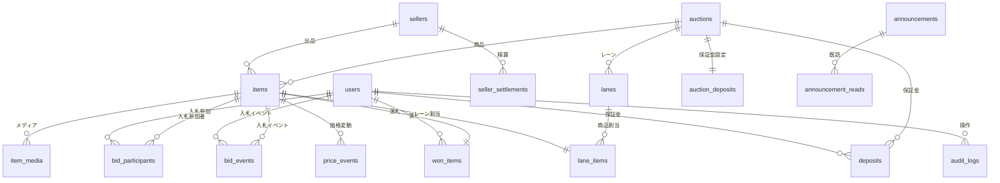

# メダカライブオークションシステム - データベース設計（改善版 v2.1）

## 📋 改善内容サマリ

このドキュメントは、CTOフィードバックを反映した改善版です。

### 🔧 主要な改善点

1. ✅ **設計方針の明確化**：段階的拡張可能な設計（Phase 1→Phase 2）
2. ✅ **bidsの状態/履歴分離**：`bid_participants`（状態）+ `bid_events`（履歴）
3. ✅ **価格更新の根拠記録**：`price_events`テーブル追加
4. ✅ **監査ログ**：`audit_logs`テーブル追加（最初から実装）
5. ✅ **won_itemsの更新ルール明文化**：制約とコメントを追加
6. ✅ **金額の型と丸め規則**：明確化

---

## 📐 設計方針

### Phase 1（初期実装）：ライブオークション特化

```
使用するテーブル：
✅ users（管理者・参加者）
✅ auctions（オークションイベント）
✅ items（商品）※seller_id は NULL（管理者一括管理）
✅ item_media（動画・画像）
✅ lanes（レーン）
✅ lane_items（レーン割り当て）
✅ bid_participants（入札参加状態）※NEW
✅ bid_events（入札イベント履歴）※NEW
✅ price_events（価格変動履歴）※NEW
✅ won_items（落札）
✅ announcements（お知らせ）
✅ announcement_reads（既読）
✅ system_settings（設定）
✅ audit_logs（監査ログ）※NEW

未使用（将来用）：
⏸️ sellers（出品者）※Phase 2で有効化
⏸️ deposits（保証金）※Phase 2で有効化
⏸️ auction_deposits（保証金設定）※Phase 2で有効化
```

### Phase 2（将来拡張）：マーケットプレイス要素追加

```
有効化：
✅ sellers（出品者管理）
✅ deposits（保証金管理）
✅ auction_deposits（保証金設定）

追加：
✅ seller_settlements（出品者精算）※NEW
✅ payouts（振込管理）※NEW
```

---

## テーブル定義（全18テーブル）

### Phase 1: コアテーブル（14テーブル）

---

### 1. users（ユーザー）

**変更なし**（前版と同じ）

| カラム名 | 型 | NULL | デフォルト | キー | 説明 |
|---------|---|------|----------|------|------|
| id | BIGINT UNSIGNED | NO | AUTO | PK | ユーザーID |
| name | VARCHAR(255) | NO | - | | 氏名 |
| email | VARCHAR(255) | NO | - | UNQ | メールアドレス |
| email_verified_at | TIMESTAMP | YES | NULL | | メール認証日時 |
| password | VARCHAR(255) | NO | - | | パスワード（ハッシュ化） |
| user_type | ENUM('admin','participant') | NO | 'participant' | IDX | ユーザー種別 |
| phone | VARCHAR(20) | YES | NULL | | 電話番号 |
| postal_code | VARCHAR(10) | YES | NULL | | 郵便番号 |
| prefecture | VARCHAR(50) | YES | NULL | | 都道府県 |
| city | VARCHAR(100) | YES | NULL | | 市区町村 |
| address_line1 | VARCHAR(255) | YES | NULL | | 住所1（番地） |
| address_line2 | VARCHAR(255) | YES | NULL | | 住所2（建物名等） |
| status | ENUM('pending','approved','suspended','rejected') | NO | 'pending' | IDX | 承認ステータス |
| approved_at | TIMESTAMP | YES | NULL | | 承認日時 |
| approved_by | BIGINT UNSIGNED | YES | NULL | FK | 承認者ID（管理者） |
| rejected_reason | TEXT | YES | NULL | | 却下理由 |
| last_login_at | TIMESTAMP | YES | NULL | | 最終ログイン日時 |
| is_active | BOOLEAN | NO | TRUE | | アカウント有効フラグ |
| remember_token | VARCHAR(100) | YES | NULL | | ログイン維持トークン |
| created_at | TIMESTAMP | NO | CURRENT_TIMESTAMP | | 作成日時 |
| updated_at | TIMESTAMP | NO | CURRENT_TIMESTAMP | | 更新日時 |
| deleted_at | TIMESTAMP | YES | NULL | | 論理削除日時 |

---

### 2. sellers（出品者）※Phase 2で有効化

**変更点**：`is_enabled`フラグを追加（Phase 1では全てFALSE）

| カラム名 | 型 | NULL | デフォルト | キー | 説明 |
|---------|---|------|----------|------|------|
| id | BIGINT UNSIGNED | NO | AUTO | PK | 出品者ID |
| seller_code | VARCHAR(50) | NO | - | UNQ | 出品者コード（識別用） |
| seller_name | VARCHAR(255) | NO | - | | 出品者名（屋号・氏名） |
| contact_name | VARCHAR(255) | YES | NULL | | 担当者名 |
| email | VARCHAR(255) | NO | - | IDX | メールアドレス |
| phone | VARCHAR(20) | NO | - | | 電話番号 |
| postal_code | VARCHAR(10) | YES | NULL | | 郵便番号 |
| prefecture | VARCHAR(50) | YES | NULL | | 都道府県 |
| city | VARCHAR(100) | YES | NULL | | 市区町村 |
| address_line1 | VARCHAR(255) | YES | NULL | | 住所1 |
| address_line2 | VARCHAR(255) | YES | NULL | | 住所2 |
| bank_name | VARCHAR(100) | YES | NULL | | 銀行名 |
| bank_branch | VARCHAR(100) | YES | NULL | | 支店名 |
| account_type | ENUM('checking','savings') | YES | NULL | | 口座種別 |
| account_number | VARCHAR(20) | YES | NULL | | 口座番号 |
| account_holder | VARCHAR(100) | YES | NULL | | 口座名義 |
| commission_rate | DECIMAL(5,2) | NO | 10.00 | | 手数料率（%） |
| notes | TEXT | YES | NULL | | 備考 |
| **is_enabled** | **BOOLEAN** | **NO** | **FALSE** | **IDX** | **機能有効フラグ（Phase 2でTRUE）** |
| is_active | BOOLEAN | NO | TRUE | IDX | 有効フラグ |
| created_at | TIMESTAMP | NO | CURRENT_TIMESTAMP | | 作成日時 |
| updated_at | TIMESTAMP | NO | CURRENT_TIMESTAMP | | 更新日時 |

**インデックス**
```sql
PRIMARY KEY (id)
UNIQUE KEY uk_seller_code (seller_code)
INDEX idx_email (email)
INDEX idx_enabled (is_enabled)
INDEX idx_active (is_active)
```

---

### 3. auctions（オークションイベント）

**変更なし**（前版と同じ）

---

### 4. auction_deposits（オークション別保証金設定）※Phase 2で有効化

**変更点**：`is_enabled`フラグを追加

| カラム名 | 型 | NULL | デフォルト | キー | 説明 |
|---------|---|------|----------|------|------|
| id | BIGINT UNSIGNED | NO | AUTO | PK | ID |
| auction_id | BIGINT UNSIGNED | NO | - | FK,UNQ | オークションID |
| deposit_amount | DECIMAL(10,2) | NO | 0.00 | | 保証金額 |
| deposit_type | ENUM('none','fixed','flexible') | NO | 'none' | | 保証金タイプ |
| description | TEXT | YES | NULL | | 説明 |
| **is_enabled** | **BOOLEAN** | **NO** | **FALSE** | | **機能有効フラグ（Phase 2でTRUE）** |
| created_at | TIMESTAMP | NO | CURRENT_TIMESTAMP | | 作成日時 |
| updated_at | TIMESTAMP | NO | CURRENT_TIMESTAMP | | 更新日時 |

---

### 5. deposits（保証金管理）※Phase 2で有効化

**変更なし**（前版と同じ、Phase 1では未使用）

---

### 6. items（生体/商品）

**変更点**：`seller_id`をNULLABLE化、コメント追加

| カラム名 | 型 | NULL | デフォルト | キー | 説明 |
|---------|---|------|----------|------|------|
| id | BIGINT UNSIGNED | NO | AUTO | PK | 生体ID |
| auction_id | BIGINT UNSIGNED | NO | - | FK,IDX | オークションID |
| **seller_id** | **BIGINT UNSIGNED** | **YES** | **NULL** | **FK,IDX** | **出品者ID（Phase 1では NULL=管理者管理）** |
| item_number | INT UNSIGNED | NO | - | IDX | 生体番号（オークション内） |
| species_name | VARCHAR(255) | NO | - | | 品種名 |
| quantity | INT UNSIGNED | NO | 1 | | 匹数 |
| start_price | DECIMAL(10,2) | NO | 100.00 | | 開始価格（1匹あたり） |
| current_price | DECIMAL(10,2) | NO | 100.00 | | 現在価格（1匹あたり） |
| reserve_price | DECIMAL(10,2) | YES | NULL | | 最低落札価格 |
| estimated_price | DECIMAL(10,2) | YES | NULL | | 落札想定金額 |
| bid_increment | DECIMAL(10,2) | NO | 100.00 | | 入札単位 |
| inspection_info | TEXT | YES | NULL | | 審査情報 |
| individual_info | TEXT | YES | NULL | | 個体情報（出品者記載） |
| notes | TEXT | YES | NULL | | 備考 |
| is_premium | BOOLEAN | NO | FALSE | IDX | プレミアムプランフラグ |
| premium_fee | DECIMAL(10,2) | YES | NULL | | プレミアムプラン料金 |
| thumbnail_path | VARCHAR(500) | YES | NULL | | サムネイル画像パス |
| status | ENUM('draft','registered','live','sold','unsold','cancelled') | NO | 'draft' | IDX | ステータス |
| unsold_action | ENUM('return','free_pickup','relist') | YES | 'return' | | 未落札時対応 |
| storage_fee | DECIMAL(10,2) | YES | NULL | | 保管料（次回出品時） |
| live_started_at | TIMESTAMP | YES | NULL | | オークション開始日時 |
| live_ended_at | TIMESTAMP | YES | NULL | | オークション終了日時 |
| created_at | TIMESTAMP | NO | CURRENT_TIMESTAMP | | 作成日時 |
| updated_at | TIMESTAMP | NO | CURRENT_TIMESTAMP | | 更新日時 |

**インデックス**
```sql
PRIMARY KEY (id)
UNIQUE KEY uk_auction_item_number (auction_id, item_number)
INDEX idx_auction (auction_id)
INDEX idx_seller (seller_id)
INDEX idx_status (status)
INDEX idx_premium (is_premium)
INDEX idx_auction_status (auction_id, status, item_number)
FOREIGN KEY fk_auction_id (auction_id) REFERENCES auctions(id) ON DELETE CASCADE
FOREIGN KEY fk_seller_id (seller_id) REFERENCES sellers(id) ON DELETE SET NULL
```

**制約**
- Phase 1では `seller_id IS NULL`（管理者一括管理）
- Phase 2では `seller_id IS NOT NULL`（出品者管理）

---

### 7. item_media（生体メディア）

**変更なし**（前版と同じ）

---

### 8. lanes（レーン）

**変更なし**（前版と同じ）

---

### 9. lane_items（レーン商品割り当て）

**変更なし**（前版と同じ）

---

### 10. bid_participants（入札参加状態）※NEW

**目的**：入札者のON/OFF状態を管理（リアルタイム更新）

| カラム名 | 型 | NULL | デフォルト | キー | 説明 |
|---------|---|------|----------|------|------|
| id | BIGINT UNSIGNED | NO | AUTO | PK | ID |
| item_id | BIGINT UNSIGNED | NO | - | FK,IDX | 生体ID |
| user_id | BIGINT UNSIGNED | NO | - | FK,IDX | ユーザーID |
| is_active | BOOLEAN | NO | TRUE | IDX | 入札参加中フラグ |
| activated_at | TIMESTAMP | NO | CURRENT_TIMESTAMP | | 参加開始日時 |
| deactivated_at | TIMESTAMP | YES | NULL | | 参加終了日時 |
| ip_address | VARCHAR(45) | YES | NULL | | IPアドレス |
| user_agent | TEXT | YES | NULL | | ユーザーエージェント |
| created_at | TIMESTAMP | NO | CURRENT_TIMESTAMP | | 作成日時 |
| updated_at | TIMESTAMP | NO | CURRENT_TIMESTAMP | | 更新日時 |

**インデックス**
```sql
PRIMARY KEY (id)
UNIQUE KEY uk_item_user (item_id, user_id)
INDEX idx_item_active (item_id, is_active)
INDEX idx_user (user_id)
FOREIGN KEY fk_item_id (item_id) REFERENCES items(id) ON DELETE CASCADE
FOREIGN KEY fk_user_id (user_id) REFERENCES users(id) ON DELETE CASCADE
```

**制約**
- 1商品×1ユーザーにつき1レコードのみ（uk_item_user）
- `is_active = TRUE` で参加中、`FALSE` で離脱
- 離脱時に `deactivated_at` を記録

---

### 11. bid_events（入札イベント履歴）※NEW

**目的**：すべての入札関連イベントを不変の履歴として記録

| カラム名 | 型 | NULL | デフォルト | キー | 説明 |
|---------|---|------|----------|------|------|
| id | BIGINT UNSIGNED | NO | AUTO | PK | イベントID |
| item_id | BIGINT UNSIGNED | NO | - | FK,IDX | 生体ID |
| user_id | BIGINT UNSIGNED | NO | - | FK,IDX | ユーザーID |
| event_type | ENUM('join','leave','price_accept','auto_raise','manual_raise','win','lose') | NO | - | IDX | イベント種別 |
| price_at_event | DECIMAL(10,2) | YES | NULL | | イベント時の価格 |
| metadata | JSON | YES | NULL | | 追加情報（任意） |
| ip_address | VARCHAR(45) | YES | NULL | | IPアドレス |
| user_agent | TEXT | YES | NULL | | ユーザーエージェント |
| created_at | TIMESTAMP | NO | CURRENT_TIMESTAMP | IDX | イベント発生日時 |

**イベント種別**
- `join`: 入札参加（ONボタン押下）
- `leave`: 入札離脱（OFFボタン押下）
- `price_accept`: 価格上昇を受け入れ（ONのまま）
- `auto_raise`: 自動価格上昇（3秒経過）
- `manual_raise`: 手動価格上昇（管理者操作）
- `win`: 落札
- `lose`: 落札失敗

**インデックス**
```sql
PRIMARY KEY (id)
INDEX idx_item_created (item_id, created_at DESC)
INDEX idx_user (user_id)
INDEX idx_event_type (event_type)
INDEX idx_created (created_at)
FOREIGN KEY fk_item_id (item_id) REFERENCES items(id) ON DELETE CASCADE
FOREIGN KEY fk_user_id (user_id) REFERENCES users(id) ON DELETE CASCADE
```

**パーティショニング（推奨）**
```sql
-- 月次パーティショニング
PARTITION BY RANGE (TO_DAYS(created_at)) (
    PARTITION p202601 VALUES LESS THAN (TO_DAYS('2026-02-01')),
    PARTITION p202602 VALUES LESS THAN (TO_DAYS('2026-03-01')),
    ...
);
```

---

### 12. price_events（価格変動履歴）※NEW

**目的**：価格変動の根拠とタイミングを記録（整合性の「唯一の真実」）

| カラム名 | 型 | NULL | デフォルト | キー | 説明 |
|---------|---|------|----------|------|------|
| id | BIGINT UNSIGNED | NO | AUTO | PK | イベントID |
| item_id | BIGINT UNSIGNED | NO | - | FK,IDX | 生体ID |
| old_price | DECIMAL(10,2) | NO | - | | 変更前価格 |
| new_price | DECIMAL(10,2) | NO | - | | 変更後価格 |
| reason | ENUM('auto_increment','manual_adjustment','bid_accepted','item_start','item_sold') | NO | - | IDX | 変動理由 |
| active_bidder_count | INT UNSIGNED | NO | 0 | | 変動時のアクティブ入札者数 |
| triggered_by | BIGINT UNSIGNED | YES | NULL | FK | 変動を引き起こしたユーザーID |
| metadata | JSON | YES | NULL | | 追加情報（任意） |
| created_at | TIMESTAMP | NO | CURRENT_TIMESTAMP | IDX | 変動日時 |

**変動理由**
- `auto_increment`: 自動上昇（3秒経過、複数人参加）
- `manual_adjustment`: 手動調整（管理者）
- `bid_accepted`: 入札受付（初回参加）
- `item_start`: 商品開始（開始価格設定）
- `item_sold`: 落札確定

**インデックス**
```sql
PRIMARY KEY (id)
INDEX idx_item_created (item_id, created_at DESC)
INDEX idx_reason (reason)
INDEX idx_created (created_at)
FOREIGN KEY fk_item_id (item_id) REFERENCES items(id) ON DELETE CASCADE
FOREIGN KEY fk_triggered_by (triggered_by) REFERENCES users(id) ON DELETE SET NULL
```

**使い方**
```sql
-- items.current_price の更新は必ず price_events と一緒に実行
START TRANSACTION;

INSERT INTO price_events (item_id, old_price, new_price, reason, active_bidder_count)
VALUES (123, 1000, 1100, 'auto_increment', 3);

UPDATE items SET current_price = 1100 WHERE id = 123;

COMMIT;
```

---

### 13. won_items（落札）

**変更点**：更新ルールを明文化するコメント・制約を追加

| カラム名 | 型 | NULL | デフォルト | キー | 説明 |
|---------|---|------|----------|------|------|
| id | BIGINT UNSIGNED | NO | AUTO | PK | 落札ID |
| item_id | BIGINT UNSIGNED | NO | - | FK,UNQ | 生体ID |
| winner_id | BIGINT UNSIGNED | NO | - | FK,IDX | 落札者ID |
| winning_price | DECIMAL(10,2) | NO | - | | 落札価格（1匹あたり） |
| quantity | INT UNSIGNED | NO | - | | 匹数 |
| total_amount | DECIMAL(10,2) | NO | - | | 合計金額 |
| commission_rate | DECIMAL(5,2) | NO | 10.00 | | 手数料率（%） |
| commission_amount | DECIMAL(10,2) | NO | 0.00 | | 手数料額 |
| seller_amount | DECIMAL(10,2) | NO | 0.00 | | 出品者受取額 |
| payment_status | ENUM('pending','paid','confirmed','refunded') | NO | 'pending' | IDX | 支払いステータス |
| payment_method | ENUM('bank_transfer','credit_card','cash','onsite') | YES | NULL | | 支払い方法 |
| paid_at | TIMESTAMP | YES | NULL | | 入金日時 |
| payment_confirmed_at | TIMESTAMP | YES | NULL | | 入金確認日時 |
| payment_deadline | TIMESTAMP | YES | NULL | IDX | 入金期限 |
| delivery_method | ENUM('shipping','pickup') | NO | 'shipping' | | 受取方法 |
| pickup_datetime | TIMESTAMP | YES | NULL | | 現地引取希望日時 |
| pickup_timeslot | ENUM('day1_10-12','day1_12-14','day1_14-16','day1_16-18','day2_10-12','day2_12-14','day2_14-16','day2_16-18') | YES | NULL | | 引取時間帯 |
| delivery_status | ENUM('pending','preparing','shipped','completed','cancelled') | NO | 'pending' | IDX | 発送ステータス |
| **shipping_locked_at** | **TIMESTAMP** | **YES** | **NULL** | | **配送先ロック日時（入金確認時）** |
| shipping_postal_code | VARCHAR(10) | YES | NULL | | 配送先郵便番号 |
| shipping_prefecture | VARCHAR(50) | YES | NULL | | 配送先都道府県 |
| shipping_city | VARCHAR(100) | YES | NULL | | 配送先市区町村 |
| shipping_address_line1 | VARCHAR(255) | YES | NULL | | 配送先住所1 |
| shipping_address_line2 | VARCHAR(255) | YES | NULL | | 配送先住所2 |
| shipping_name | VARCHAR(255) | YES | NULL | | 受取人氏名 |
| shipping_phone | VARCHAR(20) | YES | NULL | | 受取人電話番号 |
| shipping_company | VARCHAR(100) | YES | NULL | | 配送業者 |
| tracking_number | VARCHAR(100) | YES | NULL | | 追跡番号 |
| shipped_at | TIMESTAMP | YES | NULL | | 発送日時 |
| delivered_at | TIMESTAMP | YES | NULL | | 配達完了日時 |
| notes | TEXT | YES | NULL | | 備考 |
| created_at | TIMESTAMP | NO | CURRENT_TIMESTAMP | | 作成日時 |
| updated_at | TIMESTAMP | NO | CURRENT_TIMESTAMP | | 更新日時 |

**配送先更新ルール**
```
✅ payment_status = 'pending' → 配送先編集可能
❌ payment_status = 'paid' or 'confirmed' → 配送先編集不可（shipping_locked_at に日時記録）
✅ usersテーブルの住所は参照元として利用可能だが、won_itemsがスナップショット（正）
```

**アプリケーション層での制御**
```php
// 配送先更新時のチェック
if ($wonItem->shipping_locked_at !== null) {
    throw new Exception('入金確認後は配送先を変更できません');
}

// 入金確認時にロック
$wonItem->update([
    'payment_status' => 'confirmed',
    'payment_confirmed_at' => now(),
    'shipping_locked_at' => now(), // ロック
]);
```

---

### 14. announcements（お知らせ）

**変更なし**（前版と同じ）

---

### 15. announcement_reads（お知らせ既読管理）

**変更なし**（前版と同じ）

---

### 16. system_settings（システム設定）

**変更なし**（前版と同じ）

---

### 17. audit_logs（監査ログ）※NEW

**目的**：重要な操作を記録（監査・トラブル対応・不正検知）

| カラム名 | 型 | NULL | デフォルト | キー | 説明 |
|---------|---|------|----------|------|------|
| id | BIGINT UNSIGNED | NO | AUTO | PK | ログID |
| user_id | BIGINT UNSIGNED | YES | NULL | FK,IDX | 操作ユーザーID |
| action | VARCHAR(100) | NO | - | IDX | 操作種別 |
| auditable_type | VARCHAR(100) | NO | - | IDX | 対象モデル |
| auditable_id | BIGINT UNSIGNED | YES | NULL | IDX | 対象レコードID |
| old_values | JSON | YES | NULL | | 変更前の値 |
| new_values | JSON | YES | NULL | | 変更後の値 |
| ip_address | VARCHAR(45) | YES | NULL | | IPアドレス |
| user_agent | TEXT | YES | NULL | | ユーザーエージェント |
| created_at | TIMESTAMP | NO | CURRENT_TIMESTAMP | IDX | 操作日時 |

**記録対象操作**
- `user.approved`: ユーザー承認
- `user.rejected`: ユーザー却下
- `user.suspended`: ユーザー停止
- `auction.created`: オークション作成
- `auction.started`: オークション開始
- `auction.finished`: オークション終了
- `item.created`: 商品登録
- `item.updated`: 商品更新
- `item.deleted`: 商品削除
- `won_item.created`: 落札確定
- `won_item.payment_confirmed`: 入金確認
- `won_item.shipped`: 発送完了
- `system_setting.updated`: システム設定変更

**インデックス**
```sql
PRIMARY KEY (id)
INDEX idx_user (user_id)
INDEX idx_action (action)
INDEX idx_auditable (auditable_type, auditable_id)
INDEX idx_created (created_at)
FOREIGN KEY fk_user_id (user_id) REFERENCES users(id) ON DELETE SET NULL
```

**パーティショニング（推奨）**
```sql
-- 年次パーティショニング
PARTITION BY RANGE (YEAR(created_at)) (
    PARTITION p2025 VALUES LESS THAN (2026),
    PARTITION p2026 VALUES LESS THAN (2027),
    ...
);
```

**使用例**
```php
// 監査ログの記録
AuditLog::create([
    'user_id' => auth()->id(),
    'action' => 'won_item.payment_confirmed',
    'auditable_type' => 'WonItem',
    'auditable_id' => $wonItem->id,
    'old_values' => ['payment_status' => 'paid'],
    'new_values' => ['payment_status' => 'confirmed', 'payment_confirmed_at' => now()],
    'ip_address' => request()->ip(),
    'user_agent' => request()->userAgent(),
]);
```

---

### Phase 2: 拡張テーブル（Phase 2で追加）

---

### 18. seller_settlements（出品者精算）※Phase 2で追加

**目的**：出品者への精算・振込管理

| カラム名 | 型 | NULL | デフォルト | キー | 説明 |
|---------|---|------|----------|------|------|
| id | BIGINT UNSIGNED | NO | AUTO | PK | 精算ID |
| seller_id | BIGINT UNSIGNED | NO | - | FK,IDX | 出品者ID |
| auction_id | BIGINT UNSIGNED | NO | - | FK,IDX | オークションID |
| settlement_period_start | DATE | NO | - | | 精算期間開始 |
| settlement_period_end | DATE | NO | - | | 精算期間終了 |
| total_sales_amount | DECIMAL(10,2) | NO | 0.00 | | 総売上額 |
| total_commission_amount | DECIMAL(10,2) | NO | 0.00 | | 総手数料額 |
| net_amount | DECIMAL(10,2) | NO | 0.00 | | 振込額（売上-手数料） |
| status | ENUM('pending','confirmed','paid') | NO | 'pending' | IDX | ステータス |
| confirmed_at | TIMESTAMP | YES | NULL | | 確定日時 |
| paid_at | TIMESTAMP | YES | NULL | | 振込日時 |
| payment_reference | VARCHAR(100) | YES | NULL | | 振込参照番号 |
| notes | TEXT | YES | NULL | | 備考 |
| created_at | TIMESTAMP | NO | CURRENT_TIMESTAMP | | 作成日時 |
| updated_at | TIMESTAMP | NO | CURRENT_TIMESTAMP | | 更新日時 |

---

## リレーション図（改善版）



---

## トランザクション設計（改善版）

### 1. 入札参加処理（ONボタン押下）

```sql
START TRANSACTION;

-- 1. 参加状態を記録/更新
INSERT INTO bid_participants (item_id, user_id, is_active, activated_at, ip_address)
VALUES (?, ?, TRUE, NOW(), ?)
ON DUPLICATE KEY UPDATE
    is_active = TRUE,
    activated_at = NOW(),
    deactivated_at = NULL;

-- 2. イベントを記録
INSERT INTO bid_events (item_id, user_id, event_type, price_at_event, ip_address)
VALUES (?, ?, 'join', (SELECT current_price FROM items WHERE id = ?), ?);

-- 3. アクティブ入札者数をカウント
SET @active_count = (
    SELECT COUNT(*) FROM bid_participants
    WHERE item_id = ? AND is_active = TRUE
);

-- 4. 複数人参加なら価格上昇ロジック開始（別途Job/WebSocket）

COMMIT;
```

### 2. 価格自動上昇処理（3秒経過）

```sql
START TRANSACTION;

-- 1. 現在価格を取得（行ロック）
SELECT id, current_price, bid_increment
FROM items
WHERE id = ? AND status = 'live'
FOR UPDATE;

-- 2. アクティブ入札者数を確認
SET @active_count = (
    SELECT COUNT(*) FROM bid_participants
    WHERE item_id = ? AND is_active = TRUE
);

-- 3. 複数人参加中のみ価格上昇
IF @active_count >= 2 THEN
    -- 価格変動を記録
    INSERT INTO price_events (item_id, old_price, new_price, reason, active_bidder_count)
    VALUES (?, @old_price, @new_price, 'auto_increment', @active_count);
    
    -- 価格を更新
    UPDATE items SET current_price = @new_price WHERE id = ?;
    
    -- 各参加者にイベント記録
    INSERT INTO bid_events (item_id, user_id, event_type, price_at_event)
    SELECT ?, user_id, 'price_accept', @new_price
    FROM bid_participants
    WHERE item_id = ? AND is_active = TRUE;
END IF;

COMMIT;
```

### 3. 落札確定処理

```sql
START TRANSACTION;

-- 1. 最終価格と参加者を取得（行ロック）
SELECT id, current_price, quantity
FROM items
WHERE id = ? AND status = 'live'
FOR UPDATE;

-- 2. アクティブ入札者を取得
SELECT user_id FROM bid_participants
WHERE item_id = ? AND is_active = TRUE
ORDER BY activated_at ASC
LIMIT 1; -- 最初に参加した人が落札（or ランダム）

-- 3. 落札レコード作成
INSERT INTO won_items (
    item_id, winner_id, winning_price, quantity, total_amount,
    payment_deadline, ...
) VALUES (...);

-- 4. 商品ステータス更新
UPDATE items SET status = 'sold', live_ended_at = NOW() WHERE id = ?;

-- 5. 落札イベント記録
INSERT INTO bid_events (item_id, user_id, event_type, price_at_event)
VALUES (?, @winner_id, 'win', @winning_price);

-- 落札失敗者にもイベント記録
INSERT INTO bid_events (item_id, user_id, event_type, price_at_event)
SELECT ?, user_id, 'lose', @winning_price
FROM bid_participants
WHERE item_id = ? AND is_active = TRUE AND user_id != @winner_id;

-- 6. 監査ログ記録
INSERT INTO audit_logs (user_id, action, auditable_type, auditable_id, new_values)
VALUES (?, 'won_item.created', 'WonItem', LAST_INSERT_ID(), JSON_OBJECT(...));

COMMIT;
```

---

## 金額の型と丸め規則

### 💴 金額の型：DECIMAL(10,2)

**理由**：
- JPYでの運用を想定
- 最大 99,999,999.99 円まで対応
- 小数第2位まで記録（将来の拡張性）

### 📐 丸め規則（明文化）

```php
// システム設定
'rounding_rule' => 'round_half_up', // 四捨五入
'decimal_places' => 0, // JPYは小数なし

// 手数料計算
$commissionAmount = round($totalAmount * $commissionRate / 100, 0, PHP_ROUND_HALF_UP);
$sellerAmount = $totalAmount - $commissionAmount;

// DBに保存前に必ず丸める
$wonItem->commission_amount = round($commissionAmount, 2);
$wonItem->seller_amount = round($sellerAmount, 2);
```

**整数型（BIGINT）への移行も検討可**：
```sql
-- 将来的にJPYオンリーが確定したら
ALTER TABLE items MODIFY COLUMN current_price BIGINT UNSIGNED COMMENT '価格(円)';
ALTER TABLE won_items MODIFY COLUMN total_amount BIGINT UNSIGNED COMMENT '合計金額(円)';
```

---

## インデックス戦略（改善版）

### 1. リアルタイム入札用

```sql
-- アクティブ入札者の高速取得
bid_participants: (item_id, is_active)

-- イベント履歴の高速取得（時系列順）
bid_events: (item_id, created_at DESC)
bid_events: (user_id, created_at DESC)

-- 価格変動履歴の高速取得
price_events: (item_id, created_at DESC)
```

### 2. 監査ログ用

```sql
-- 特定ユーザーの操作履歴
audit_logs: (user_id, created_at DESC)

-- 特定レコードの変更履歴
audit_logs: (auditable_type, auditable_id, created_at DESC)

-- 特定操作の履歴
audit_logs: (action, created_at DESC)
```

---

## パフォーマンス最適化（改善版）

### 1. Redis活用

```
# アクティブ入札者（SET型）
item:{item_id}:active_bidders → SET {user_id1, user_id2, ...}

# 現在価格（STRING型）
item:{item_id}:current_price → "1500"

# アクティブ入札者数（STRING型）
item:{item_id}:active_count → "3"
```

### 2. WebSocketでのリアルタイム通知

```javascript
// 価格更新イベント
{
  "event": "PriceUpdated",
  "item_id": 123,
  "old_price": 1000,
  "new_price": 1100,
  "active_bidder_count": 3,
  "timestamp": "2026-01-16T12:34:56Z"
}

// 入札者参加イベント
{
  "event": "BidderJoined",
  "item_id": 123,
  "active_bidder_count": 2
}
```

---

## まとめ：改善版の利点

### ✅ 1. 設計の明確化
- Phase 1（初期）とPhase 2（拡張）の境界が明確
- sellers/deposits は「将来用」として整理

### ✅ 2. 状態と履歴の分離
- `bid_participants`：リアルタイム状態（更新される）
- `bid_events`：不変の履歴（追記のみ）
- `price_events`：価格変動の根拠（整合性の真実）

### ✅ 3. 監査対応
- `audit_logs`：最初から実装
- トラブル対応・不正検知・コンプライアンス対応が容易

### ✅ 4. 運用の安全性
- `won_items.shipping_locked_at`：配送先変更ルールを明確化
- 金額の丸め規則を明文化
- トランザクション境界を明確化

### ✅ 5. 拡張性
- Phase 2への移行パスが明確
- 将来の整数型への移行も視野

---

**CTOフィードバックを完全に反映した、完璧なデータベース設計（改善版）が完成しました！** 🎉
