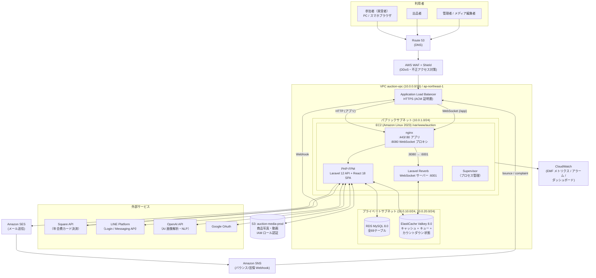
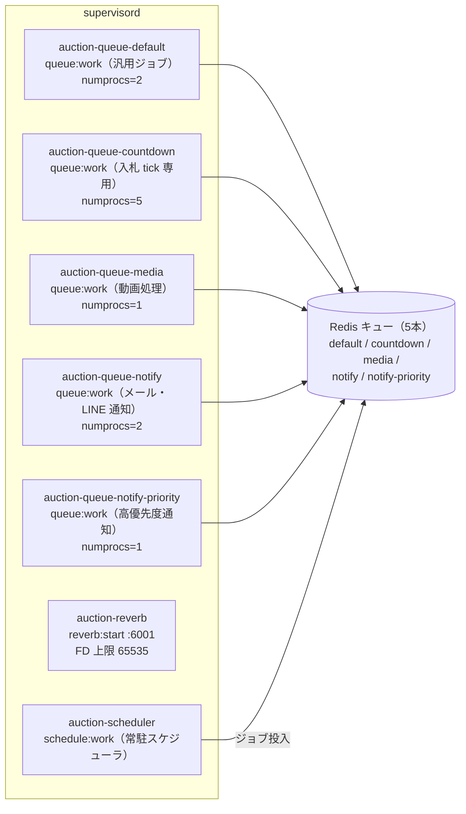
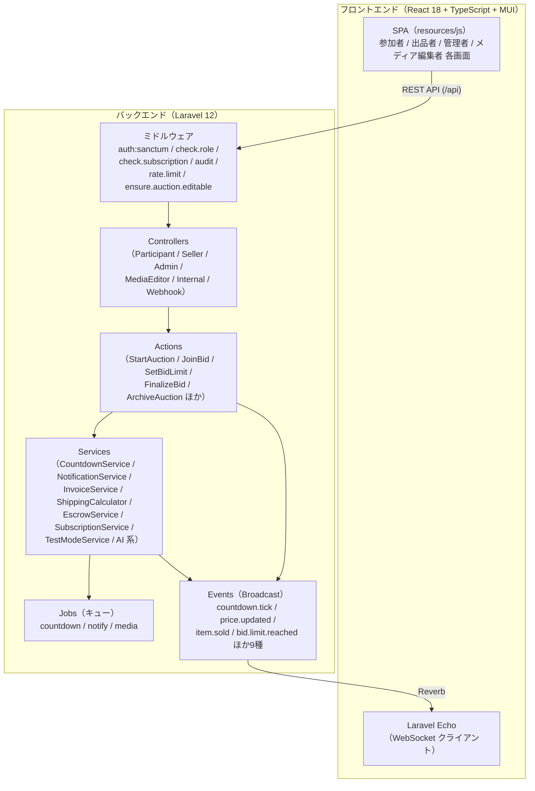
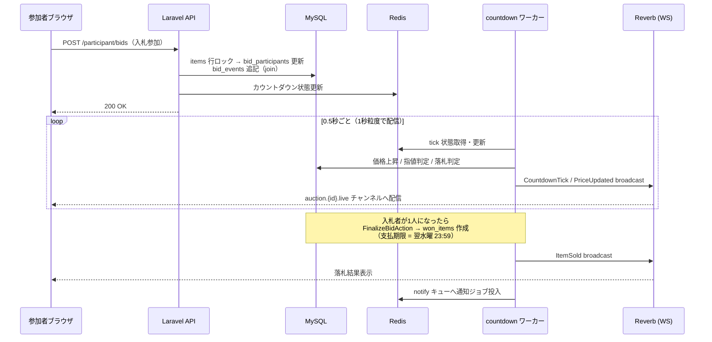
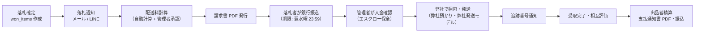

# システム構成図

**文書番号**: ARC-2026-001  
**事業者**: 株式会社BeerO'Clock  
**作成者**: 代表取締役 松崎 航平  
**承認者**: 代表取締役 松崎 航平  
**版数**: 1.0  
**作成日**: 2026年6月10日  
**対象システム**: 日本メダカオンライン市場（本番環境）

> 本書はシステム全体の構成を1枚で俯瞰するためのドキュメントです。
> 構築手順は [AWS_インフラ構築作業指示書](../infrastructure/AWS_インフラ構築作業指示書.md)、
> 運用手順は [保守マニュアル](../operations/保守マニュアル.md) を参照してください。

---

## 1. 全体構成図（AWS インフラ）

### 構成上の要点

| 項目 | 内容 |
|---|---|
| リージョン | ap-northeast-1（東京） |
| EC2 | t3.small（通常時）→ t3.large（オークション開催時にスケールアップ） |
| RDS | db.t3.micro Single-AZ（通常時）→ db.t3.medium Multi-AZ（開催時） |
| ElastiCache | cache.t3.micro（通常時）→ cache.t3.medium + Replica（開催時） |
| S3 | `auction-media-prod`。EC2 の IAM ロールで認証（アクセスキー不使用） |
| WebSocket | Reverb はポート **6001** で listen。nginx の 8080 が WebSocket 専用プロキシ口（ALB → nginx:8080 → Reverb:6001） |
| NAT Gateway | 不使用（プライベートサブネットの RDS/Redis は外部通信不要） |

---

## 2. EC2 内部プロセス構成（Supervisor 管理）

### キュー構成（本番 supervisor 実機確認済み: 2026-06-10）

| キュー | 乗るジョブ | ワーカー | 主な worker パラメータ |
|---|---|---|---|
| `countdown` | ProcessAuctionCountdownJob（オークション全レーンの 0.5秒 tick） | auction-queue-countdown（numprocs=5） | sleep=1 / timeout=18000 / memory=256 |
| `notify` | メール・LINE 通知ジョブ全般（落札通知・入金催促・キャンペーン配信 等） | auction-queue-notify（numprocs=2） | timeout=120 / max-jobs=1000 |
| `notify-priority` | 高優先度通知（認証系トランザクションメール等） | auction-queue-notify-priority（numprocs=1） | sleep=1 / timeout=60 |
| `media` | ProcessItemVideoJob（動画圧縮・ポスター生成） | auction-queue-media（numprocs=1） | tries=2 / timeout=3600 / memory=512 |
| `default` | その他汎用ジョブ | auction-queue-default（numprocs=2） | timeout=300 / memory=128 |

### スケジューラ（schedule:work）

| コマンド / ジョブ | 間隔 | 役割 |
|---|---|---|
| `announcements:publish-scheduled` | 毎分 | 予約お知らせの公開 |
| `auctions:start-scheduled` | 毎分 | 開催予定オークションの自動開始 |
| `auctions:dispatch-start-notice` | 毎分 | 開始30分前の予告通知 |
| `auctions:monitor-jobs` | 毎分 | カウントダウンジョブの監視・自動復旧 |
| SendPaymentReminderJob | 30分毎 | 未入金者への入金催促 |
| SendAuctionPreviewJob | 毎日 18:00 | 翌日開催の前日予告 |
| `subscriptions:renew` | 毎日 03:00 | 年会費の自動更新課金 |
| `reports:generate weekly / monthly` | 月曜 09:00 / 毎月1日 09:00 | レポート自動生成 |

---

## 3. アプリケーション層構成

---

## 4. ライブ入札のリアルタイムデータフロー

---

## 5. 落札後ワークフロー（業務フロー）

---

## 6. 環境一覧

| 環境 | ドメイン | 用途 |
|---|---|---|
| 本番 | medaka-auction.jp | 本番運用 |
| ステージング | medaka-auction.com | 検証（旧本番ドメインを転用、ステージング ALB を向き先に設定） |

---

## 関連ドキュメント

- [AWS_インフラ構築作業指示書](../infrastructure/AWS_インフラ構築作業指示書.md) — 各リソースの構築手順
- [CloudWatch監視設定手順書](../infrastructure/CloudWatch監視設定手順書.md) — 監視・アラーム
- [保守マニュアル](../operations/保守マニュアル.md) — Supervisor / キュー / デプロイ運用
- [データベース設計書](データベース設計書.md) — DB 論理設計・ER 図
- [APIリファレンス](../api/APIリファレンス.md) — 全エンドポイント

---

## 改訂履歴

| 版数 | 日付 | 改訂内容 | 作成・承認 |
|---|---|---|---|
| 1.0 | 2026-06-10 | 初版作成（本番 supervisor・キュー構成は実機確認値を反映） | 株式会社BeerO'Clock 松崎 航平 |
