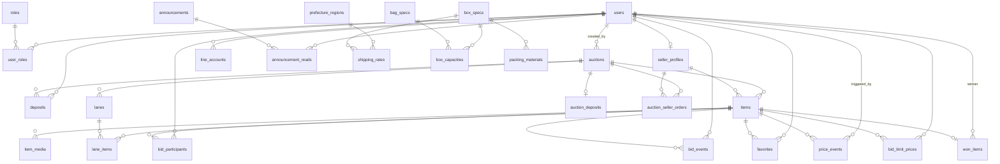
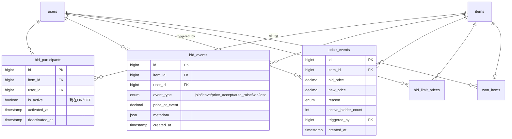
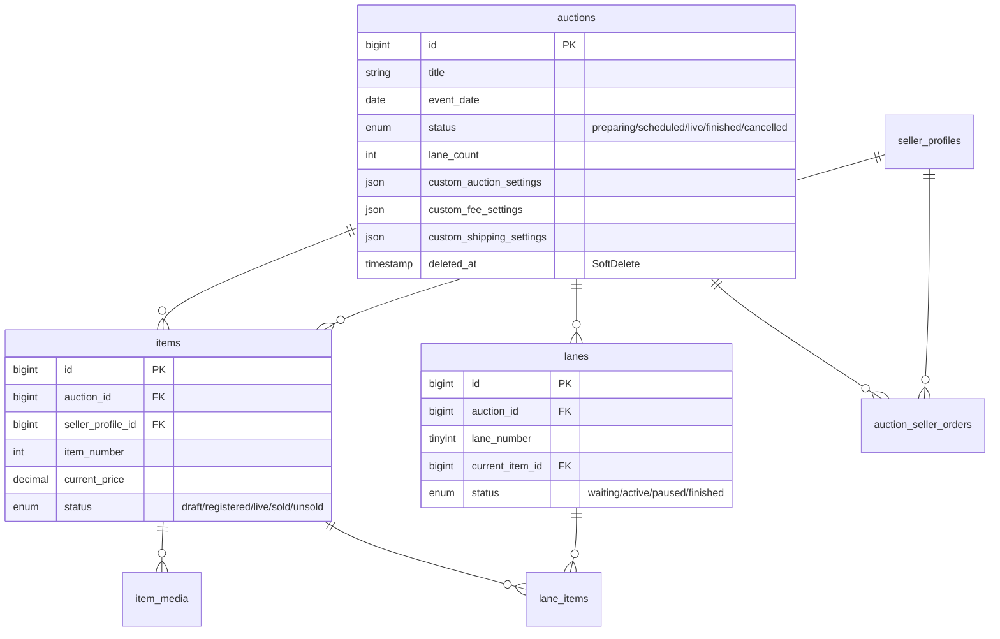
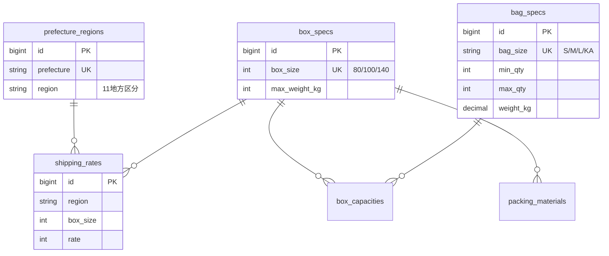

# データベース設計書

**文書番号**: DB-2026-001  
**版数**: 1.1  
**最終更新**: 2026年4月22日  
**対象システム**: メダカオークション（めだかライブオークション）  
**基盤**: Laravel 12 / MySQL 8.0  
**テーブル総数**: 46（本番40 + アーカイブ5 + 監査1）

---

## 目次

1. [全体構成と設計思想](#1-全体構成と設計思想)
2. [ER図（全体）](#2-er図全体)
3. [ER図（コアドメイン別）](#3-er図コアドメイン別)
4. [テーブル一覧（分類別）](#4-テーブル一覧分類別)
5. [主要テーブル詳細仕様](#5-主要テーブル詳細仕様)
6. [リレーション一覧](#6-リレーション一覧)
7. [インデックス戦略](#7-インデックス戦略)
8. [データ肥大化とアーカイブ戦略](#8-データ肥大化とアーカイブ戦略)

---

## 1. 全体構成と設計思想

### 1.1 4つのデータレイヤー

本システムのテーブルは、**ライフサイクルと更新頻度**によって4つに明確に分離されています。
この分離が、後述するアーカイブ戦略の根拠になります。

| レイヤー | 特徴 | 代表テーブル | 増加傾向 |
|---------|------|-------------|---------|
| **① マスタデータ** | 低頻度更新、永続保持 | users, auctions, items, seller_profiles | 緩やか |
| **② オペレーショナルデータ（揮発性）** | オークション開催中のみ高頻度更新 | bid_participants, lane_items, bid_limit_prices | スパイク型 |
| **③ イベントログ（追記専用）** | INSERTのみ。UPDATE/DELETEなし | **bid_events**, **price_events**, audit_logs | **直線的に肥大化** |
| **④ トランザクションデータ** | 決済・配送の実績 | won_items, deposits | 開催ごとに追加 |

### 1.2 監査可能性を担保する不変性（Immutability）

オークションの公正性を保証するため、以下3つは**INSERT-only**で運用されています。

- `bid_events` — すべての入札アクション（join / leave / 価格受諾 / 自動上げ / 落札 / 失注）
- `price_events` — 価格変動の全履歴（理由付き）
- `audit_logs` — 管理操作の監査ログ

これらは「消してはいけない」ログなので、後述のアーカイブ戦略が特に重要です。

### 1.3 State + Event パターン

現在の状態と履歴を分離する設計が徹底されています。

| 現在の状態（State）| 履歴（Event）|
|--------------------|-------------|
| `bid_participants.is_active` | `bid_events` |
| `items.current_price` | `price_events` |
| `lanes.current_item_id` | `lane_items.started_at/finished_at` |

→ 現在値は1行を UPDATE、履歴は INSERT で積んでいく二層構造。

---

## 2. ER図（全体）



---

## 3. ER図（コアドメイン別）

### 3.1 入札ドメイン（ライブ進行中の中核）



### 3.2 オークション構造ドメイン



### 3.3 配送計算ドメイン



---

## 4. テーブル一覧（分類別）

### ① マスタデータ（10テーブル）
| # | テーブル | 用途 |
|---|---------|------|
| 1 | users | 参加者・出品者・管理者アカウント（Soft Delete対応） |
| 2 | roles | ロール定義（admin / seller / participant） |
| 3 | user_roles | ユーザー×ロールのJUNCTION |
| 4 | seller_profiles | 出品者プロフィール（銀行情報・SNS・手数料率） |
| 5 | auctions | オークションイベント（Soft Delete対応） |
| 6 | items | 出品商品 |
| 7 | item_media | 商品の写真・動画 |
| 8 | lanes | オークションレーン（同時進行枠） |
| 9 | announcements | お知らせ |
| 10 | announcement_reads | お知らせ既読管理 |

### ② オペレーショナルデータ・揮発性（5テーブル）★肥大化注意
| # | テーブル | 1オークション当たりの想定レコード数 |
|---|---------|--------------------------------|
| 11 | bid_participants | 商品数 × 参加人数（例: 50商品×100人 = 5,000件） |
| 12 | lane_items | 商品数と等価（例: 50件） |
| 13 | bid_limit_prices | 上限設定をした人の数（例: 数百件） |

### ③ イベントログ・追記専用（3テーブル）★★★最重要
| # | テーブル | 想定増加量 |
|---|---------|-----------|
| 14 | **bid_events** | **1オークションで数万〜数十万行** |
| 15 | **price_events** | **1オークションで数千〜数万行** |
| 16 | audit_logs | 管理操作ごとに1行 |

### ④ トランザクションデータ（4テーブル）
| # | テーブル | 用途 |
|---|---------|------|
| 17 | won_items | 落札実績・決済・配送情報 |
| 18 | deposits | 参加者のデポジット |
| 19 | auction_deposits | オークション別デポジット設定 |
| 20 | favorites | お気に入り |

### ⑤ 設定・構成マスタ（6テーブル）
| # | テーブル | 用途 |
|---|---------|------|
| 21 | system_settings | システム全般の設定値（40+のキー） |
| 22 | bag_specs | 袋サイズ規格 |
| 23 | box_specs | 箱サイズ規格 |
| 24 | box_capacities | 箱×袋の収容可能数 |
| 25 | packing_materials | 梱包資材コスト |
| 26 | shipping_rates | 地方×箱サイズ別送料 |
| 27 | prefecture_regions | 都道府県→地方マッピング |

### ⑥ LINE連携（3テーブル）
| # | テーブル | 用途 |
|---|---------|------|
| 28 | line_accounts | LINEアカウント連携 |
| 29 | line_notification_settings | 通知種別ごとのON/OFF |
| 30 | line_notification_logs | 通知送信ログ |

### ⑦ 認証・トークン（4テーブル）
| # | テーブル | 用途 |
|---|---------|------|
| 31 | email_verification_tokens | メール認証トークン |
| 32 | personal_access_tokens | Sanctum APIトークン |
| 33 | sessions | セッション |
| 34 | password_reset_tokens | パスワードリセット |

### ⑧ 業務補助（1テーブル）
| # | テーブル | 用途 |
|---|---------|------|
| 35 | auction_seller_orders | オークション別の出品者表示順 |

### ⑨ フレームワーク基盤（4テーブル）
| # | テーブル | 用途 |
|---|---------|------|
| 36 | cache | キャッシュストア |
| 37 | cache_locks | キャッシュロック |
| 38 | jobs | キュージョブ |
| 39 | job_batches | バッチジョブ |
| 40 | failed_jobs | 失敗ジョブ |

### ⑩ アーカイブ（6テーブル）★本ドキュメント §8 で定義
| # | テーブル | 用途 |
|---|---------|------|
| 41 | bid_events_archive | 終了オークションの入札イベント履歴退避先 |
| 42 | price_events_archive | 終了オークションの価格変動履歴退避先 |
| 43 | bid_participants_archive | 終了オークションの参加者状態退避先 |
| 44 | bid_limit_prices_archive | 終了オークションの上限価格退避先 |
| 45 | lane_items_archive | 終了オークションのレーン進行履歴退避先 |
| 46 | auction_archive_logs | アーカイブ／復元操作の監査ログ |

---

## 5. 主要テーブル詳細仕様

以下はアーカイブ対象候補と、入札ロジックの中核になるテーブルのみ詳細を記載します。
（全カラム定義はマイグレーションファイルを正として参照してください）

### 5.1 `bid_events` — 入札イベントログ（追記専用）

| カラム | 型 | NULL | 説明 |
|-------|---|-----|------|
| id | BIGINT | NO | PK |
| item_id | BIGINT | NO | FK → items（CASCADE） |
| user_id | BIGINT | NO | FK → users（CASCADE） |
| event_type | ENUM | NO | join / leave / price_accept / auto_raise / manual_raise / win / lose |
| price_at_event | DECIMAL(10,2) | YES | イベント時の価格 |
| metadata | JSON | YES | 追加情報 |
| ip_address | VARCHAR(45) | YES | |
| user_agent | TEXT | YES | |
| created_at | TIMESTAMP | NO | |

**インデックス**: `(item_id, created_at)`, `(user_id)`, `(event_type)`, `(created_at)`
**特性**: INSERT-only。UPDATE / DELETE は業務上発生しない。
**肥大化の主犯**: 入札合戦が激しいほど行数が跳ね上がります。

### 5.2 `price_events` — 価格変動履歴（追記専用）

| カラム | 型 | NULL | 説明 |
|-------|---|-----|------|
| id | BIGINT | NO | PK |
| item_id | BIGINT | NO | FK → items |
| old_price | DECIMAL(10,2) | NO | |
| new_price | DECIMAL(10,2) | NO | |
| reason | ENUM | NO | auto_increment / manual_adjustment / bid_accepted / item_start / item_sold |
| active_bidder_count | INT | NO | その時点のON参加者数 |
| triggered_by | BIGINT | YES | FK → users（SET NULL） |
| metadata | JSON | YES | |
| created_at | TIMESTAMP | NO | |

**インデックス**: `(item_id, created_at)`, `(reason)`, `(created_at)`
**特性**: INSERT-only。`items.current_price` の整合性チェックに使う。

### 5.3 `bid_participants` — 入札ON/OFF状態

| カラム | 型 | NULL | 説明 |
|-------|---|-----|------|
| id | BIGINT | NO | PK |
| item_id | BIGINT | NO | FK → items |
| user_id | BIGINT | NO | FK → users |
| is_active | BOOLEAN | NO | 現在のON/OFF |
| activated_at | TIMESTAMP | NO | |
| deactivated_at | TIMESTAMP | YES | |
| ip_address | VARCHAR(45) | YES | |
| user_agent | TEXT | YES | |

**ユニーク**: `(item_id, user_id)`
**特性**: 商品ごとに1ユーザー1行だが、商品数×参加者数で膨らむ。UPDATEが発生する唯一の揮発性テーブル。

### 5.4 `bid_limit_prices` — 上限価格（指値）

| カラム | 型 | NULL | 説明 |
|-------|---|-----|------|
| id | BIGINT | NO | PK |
| item_id | BIGINT | NO | FK → items |
| user_id | BIGINT | NO | FK → users |
| limit_price | DECIMAL(12,2) | NO | |
| is_triggered | BOOLEAN | NO | 上限到達フラグ |
| triggered_at | TIMESTAMP | YES | |

**ユニーク**: `(item_id, user_id)`

### 5.5 `lane_items` — レーン内の商品進行

| カラム | 型 | NULL | 説明 |
|-------|---|-----|------|
| id | BIGINT | NO | PK |
| lane_id | BIGINT | NO | FK → lanes |
| item_id | BIGINT | NO | FK → items（UNIQUE） |
| sequence_order | INT | NO | レーン内の順序 |
| started_at | TIMESTAMP | YES | |
| finished_at | TIMESTAMP | YES | |
| duration_seconds | INT | YES | |

---

## 6. リレーション一覧

主要な外部キー関係（ON DELETE の挙動付き）:

| 親 | 子 | 関係 | ON DELETE |
|----|----|------|-----------|
| users | user_roles | 1:N | CASCADE |
| users | seller_profiles | 1:1 | CASCADE |
| users | auctions(created_by) | 1:N | — |
| users | won_items(winner_id) | 1:N | RESTRICT |
| users | bid_participants | 1:N | CASCADE |
| users | bid_events | 1:N | CASCADE |
| users | price_events(triggered_by) | 1:N | SET NULL |
| auctions | items | 1:N | CASCADE |
| auctions | lanes | 1:N | CASCADE |
| auctions | auction_deposits | 1:1 | CASCADE |
| items | won_items | 1:1 | RESTRICT |
| items | bid_events | 1:N | CASCADE |
| items | price_events | 1:N | CASCADE |
| items | bid_participants | 1:N | CASCADE |
| items | bid_limit_prices | 1:N | CASCADE |
| items | lane_items | 1:N | CASCADE |
| items | item_media | 1:N | CASCADE |
| lanes | lane_items | 1:N | CASCADE |

**注意**: `items` を削除すると `won_items` は RESTRICT で防がれる（落札実績があるアイテムは消せない）。一方、`bid_events` / `price_events` は CASCADE なので、items を物理削除すると履歴も消える設計。→ アーカイブ時は `items` を消さず、履歴側だけを別テーブルへ退避するのが安全。

---

## 7. インデックス戦略

### 7.1 ライブ時の高頻度クエリ向け

| インデックス | 用途 |
|------------|------|
| `bid_events(item_id, created_at)` | 商品別の入札履歴を時系列取得 |
| `price_events(item_id, created_at)` | 商品別の価格推移 |
| `bid_participants(item_id, is_active)` | アクティブ参加者数のカウント（カウントダウン判定の中核） |
| `lanes(auction_id, status)` | レーン状態取得 |
| `items(auction_id, status, item_number)` | レーン表示用アイテム検索 |

### 7.2 管理・運用クエリ向け

| インデックス | 用途 |
|------------|------|
| `won_items(winner_id, payment_status)` | ユーザー別の未払い落札一覧 |
| `won_items(payment_deadline)` | 期限超過通知バッチ |
| `auctions(event_date, status)` | 開催予定一覧 |

---

## 8. データ肥大化とアーカイブ戦略（実装済み：案A）

### 8.1 アーカイブの方針

本システムは「状態」と「履歴」が明確に分離されており、オークション終了後
（`auctions.status = 'finished'`）は**履歴系データが業務的に読み取り専用**になります。
決済・配送処理は `won_items` だけで完結するため、履歴系テーブルは安全に別テーブルへ退避可能です。

実装アプローチとして **「案A：本番と同構造の `_archive` テーブルへ物理コピー」** を採用しました。
（検討した案B: MySQLパーティショニングはFK併用不可、案C: S3+Athenaは規模が早いため将来オプション）

### 8.2 退避対象の切り分け

| テーブル | 退避 | 備考 |
|---------|------|------|
| **bid_events** | ◎ 実装済 | 追記専用、終了後は閲覧のみ |
| **price_events** | ◎ 実装済 | 追記専用、終了後は閲覧のみ |
| **bid_participants** | ◎ 実装済 | 終了後は静的 |
| **bid_limit_prices** | ◎ 実装済 | 終了後は静的 |
| **lane_items** | ◎ 実装済 | 進行履歴 |
| audit_logs | △ 対象外 | オークション横断の可能性、別方針（時系列切り出し）を将来検討 |
| won_items | ✕ 対象外 | 決済・配送・税務で長期参照必須 |
| items / auctions | ✕ 対象外 | 落札実績・監査から参照される |

### 8.3 実装構成

#### 8.3.1 テーブル

マイグレーション: `src/database/migrations/2026_04_14_000001_create_auction_archive_tables.php`

| アーカイブテーブル | 元テーブル | 追加カラム |
|------------------|----------|-----------|
| `bid_events_archive` | `bid_events` | `archived_auction_id`, `archived_at` |
| `price_events_archive` | `price_events` | 同上 |
| `bid_participants_archive` | `bid_participants` | 同上 |
| `bid_limit_prices_archive` | `bid_limit_prices` | 同上 |
| `lane_items_archive` | `lane_items` | 同上 |
| `auction_archive_logs` | — | アーカイブ／復元の監査ログ |

**設計ルール**
- 主キーは元テーブルの `id` を復元キーとして**そのまま保持**（自動採番しない）
- **外部キーは張らない**（元側を物理削除しても独立して保持できるように）
- `archived_auction_id` にインデックスを張り、オークション単位で即時検索可
- 各テーブル `(item_id, created_at)` 等、元のホットクエリ向けインデックスも維持

#### 8.3.2 処理ロジック

| クラス | 役割 |
|-------|------|
| `App\Actions\Auction\ArchiveAuctionAction` | 本番 → アーカイブへ退避 |
| `App\Actions\Auction\UnarchiveAuctionAction` | アーカイブ → 本番へ復元 |
| `App\Console\Commands\ArchiveAuctionCommand` | CLI (`auction:archive`) |

**退避フロー**（`ArchiveAuctionAction::execute`）
1. 対象オークションの status=finished を検証（`--force` で回避可）
2. `auction_archive_logs` で二重アーカイブを検知
3. 対象 `item_id` 一覧を取得
4. トランザクション開始
   1. 5テーブルを `INSERT ... SELECT` で退避（5,000件単位でチャンク）
   2. 5テーブルを逆順に `DELETE`（チャンクで実行）
   3. `auction_archive_logs` に件数とメタを記録
5. コミット。失敗時は全ロールバック
6. 結果件数を呼び出し元に返却

**復元フロー**（`UnarchiveAuctionAction::execute`）
- `archived_auction_id` 指定で本番側へ書き戻し、アーカイブ側は削除
- 監査ログに `operation='unarchive'` で記録

#### 8.3.3 CLI 使い方

```bash
# 単発：特定オークションを退避（本番 → archive）
php artisan auction:archive 123

# 件数だけ確認（実行しない）
php artisan auction:archive 123 --dry-run

# 強制実行（status=finished でない／再アーカイブも許容）
php artisan auction:archive 123 --force --note="緊急DB整理"

# 一括：finished 後7日以上経過した未アーカイブを全て退避
php artisan auction:archive

# 一括：経過日数を指定（30日）
php artisan auction:archive --days=30

# 復元：アーカイブから本番へ戻す
php artisan auction:archive 123 --unarchive --note="監査対応で復元"
```

#### 8.3.4 スケジューラ登録（任意）

運用で自動化する場合は `routes/console.php` または `app/Console/Kernel.php` に追加:

```php
use Illuminate\Support\Facades\Schedule;

// 毎日03:00に7日以上経過した finished を自動退避
Schedule::command('auction:archive --days=7')
    ->dailyAt('03:00')
    ->onOneServer()
    ->runInBackground();
```

### 8.4 既存コードへの影響

- 本番テーブルのスキーマ・FKは**一切変更していない**
- 既存のリポジトリ・Action・APIは変更不要
- 過去ログを画面表示したくなった場合の選択肢:
  1. 管理者UIだけ `_archive` テーブルを個別クエリ（推奨）
  2. `UNION ALL` で本番側と結合するリードオンリーなビュー/クエリを作成
  3. 一時的に `auction:archive --unarchive` で復元 → 閲覧 → 再アーカイブ

### 8.5 パフォーマンス観点での補足

**適切なインデックスが効いていれば数千万行までは MySQL は平然とさばきます。**
肥大化で実際に困るのは主に以下3点です。

1. **バックアップ/リストア時間** — 夜間 mysqldump が終わらなくなる
2. **DDL の所要時間** — ALTER TABLE が数時間になる
3. **集計バッチの遅延** — 管理画面の統計クエリが遅くなる

入札処理のオンライン性能は `(item_id, created_at)` インデックスで絞り込めば行数が増えても劣化しにくい設計です。
→ **今回の退避は「入札を速くするため」ではなく「運用保守・バックアップ体感を軽くするため」** が主目的です。

### 8.6 今後の拡張余地

| フェーズ | 推奨追加策 |
|---------|----------|
| 月100オークション超 | スケジューラ登録で自動化 |
| 数千万行規模 | 案C（S3 + Athena）へのエクスポート層追加 |
| audit_logs が膨大化 | 時系列パーティショニング、または別DB切り出し |
